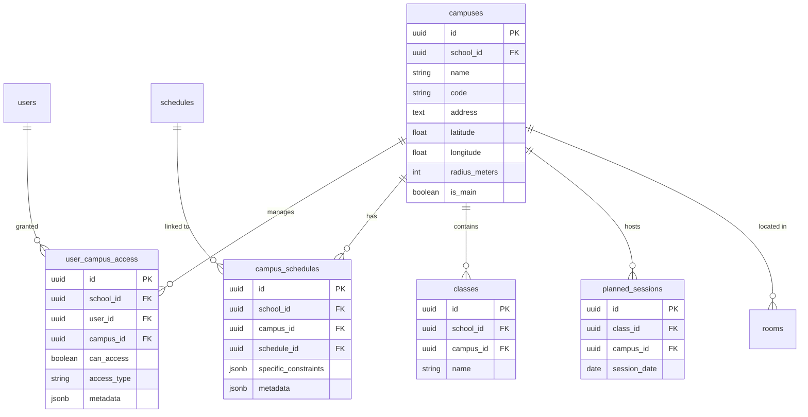
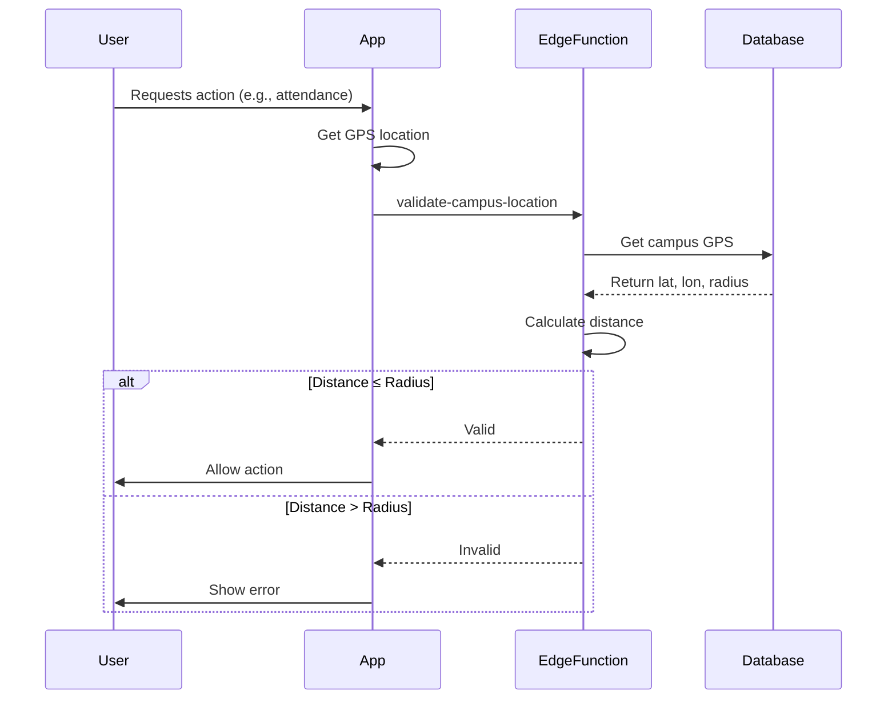

# Multi-Campus Premium Module - Technical Documentation

## Overview

The Multi-Campus module enables universities and large schools to manage multiple geographic campuses within a single NovaConnect instance. It provides granular access control, GPS-based location validation, campus-specific scheduling, and reporting.

## Architecture

### Database Schema



### Component Structure

```
NovaConnect/
├── supabase/
│   ├── migrations/
│   │   ├── 20250210000001_create_multi_campus_premium.sql
│   │   ├── 20250210000002_enable_rls_multi_campus.sql
│   │   ├── 20250210000003_create_multi_campus_audit_triggers.sql
│   │   └── 20250210000004_migrate_existing_data_multi_campus.sql
│   └── functions/
│       ├── _shared/
│       │   └── multiCampusCheck.ts
│       ├── validate-campus-location/
│       │   └── index.ts
│       └── generate-campus-report/
│           └── index.ts
├── packages/
│   ├── core/
│   │   ├── src/
│   │   │   ├── schemas/
│   │   │   │   └── multiCampus.ts
│   │   │   └── utils/
│   │   │       └── campusHelpers.ts
│   └── data/
│       └── src/
│           └── queries/
│               └── multiCampus.ts
├── apps/
│   ├── web/
│   │   └── src/
│   │       └── app/(dashboard)/school-admin/campuses/
│   └── mobile/
│       └── src/
│           ├── screens/
│           │   ├── teacher/CampusSelectionScreen.tsx
│           │   └── hooks/
│           │       └── useCampusLocation.ts
└── docs/
    ├── MULTI_CAMPUS_MODULE.md
    └── DEPLOYMENT_MULTI_CAMPUS.md
```

## Database Tables

### campuses

Extended from existing school configuration table.

**Key Columns:**
- `latitude` (float, optional): GPS latitude coordinate
- `longitude` (float, optional): GPS longitude coordinate
- `radius_meters` (int): Geofence radius in meters (default: 200)
- `is_main` (boolean): Primary campus indicator

**Indexes:**
- `idx_campuses_school_id` on `school_id`
- `idx_campuses_is_main` on `is_main`

### user_campus_access

Manages user permissions per campus.

**Columns:**
- `id` (uuid, PK): Unique identifier
- `school_id` (uuid, FK): Reference to schools table
- `user_id` (uuid, FK): Reference to users table
- `campus_id` (uuid, FK): Reference to campuses table
- `can_access` (boolean): Current access status
- `access_type` (varchar): Access level - `full_access`, `restricted`, `read_only`
- `metadata` (jsonb): Additional access constraints
- `created_at` (timestamptz): Creation timestamp
- `updated_at` (timestamptz): Last update timestamp

**Constraints:**
- Unique on `(user_id, campus_id)`
- Check on `access_type` in allowed values

**Indexes:**
- `idx_user_campus_access_school_id` on `school_id`
- `idx_user_campus_access_user_id` on `user_id`
- `idx_user_campus_access_campus_id` on `campus_id`
- `idx_user_campus_access_can_access` on `can_access`

### campus_schedules

Links schedules to campuses with specific constraints.

**Columns:**
- `id` (uuid, PK): Unique identifier
- `school_id` (uuid, FK): Reference to schools table
- `campus_id` (uuid, FK): Reference to campuses table
- `schedule_id` (uuid, FK): Reference to schedules table
- `specific_constraints` (jsonb): Campus-specific schedule constraints
- `metadata` (jsonb): Additional metadata
- `created_at` (timestamptz): Creation timestamp
- `updated_at` (timestamptz): Last update timestamp

**Constraints:**
- Unique on `(campus_id, schedule_id)`

**Indexes:**
- `idx_campus_schedules_school_id` on `school_id`
- `idx_campus_schedules_campus_id` on `campus_id`
- `idx_campus_schedules_schedule_id` on `schedule_id`

### Extended Tables

#### classes.campus_id
- Type: uuid (nullable)
- Reference: campuses(id)
- Purpose: Assign class to specific campus

#### planned_sessions.campus_id
- Type: uuid (nullable)
- Reference: campuses(id)
- Purpose: Assign session to specific campus

## RLS Policies

### Helper Functions

#### check_multi_campus_enabled(school_id)
Verifies school has active premium/enterprise license with multi-campus module enabled.

```sql
RETURNS BOOLEAN
```

**Logic:**
1. Check for active license (premium/enterprise)
2. Verify license not expired
3. Verify 'multi_campus' in school.enabled_modules

#### check_user_campus_access(user_id, campus_id)
Checks if user has permission to access a campus.

```sql
RETURNS BOOLEAN
```

**Logic:**
1. Check user_campus_access table for explicit access
2. Allow if user is school_admin or super_admin
3. Return can_access flag

### Policy: user_campus_access

**SELECT:**
- Users can see their own access records
- School admins can see all access records for their school

**INSERT/UPDATE/DELETE:**
- School admins only
- Requires multi_campus_enabled check

### Policy: campus_schedules

**SELECT:**
- Users can see schedules for campuses they have access to
- School admins can see all schedules

**INSERT/UPDATE/DELETE:**
- School admins only
- Requires multi_campus_enabled check

### Policy: classes (Extended)

**SELECT:**
- Filter by campus_id if multi-campus enabled
- Bypass campus check if module disabled

### Policy: planned_sessions (Extended)

**SELECT:**
- Filter by campus_id if multi-campus enabled
- Bypass campus check if module disabled

## Edge Functions

### validate-campus-location

Validates user GPS location within campus boundaries.

**Endpoint:** `POST /functions/v1/validate-campus-location`

**Request:**
```typescript
{
  schoolId: string;
  campusId: string;
  userLat: number;
  userLon: number;
  userId?: string;
  action: 'attendance' | 'lesson_log' | 'qr_scan';
}
```

**Success Response:**
```typescript
{
  valid: true;
  distance: number; // meters
  campus: {
    id: string;
    name: string;
    code: string;
    address: string;
    radiusMeters: number;
  };
  message: string;
}
```

**Error Response:**
```typescript
{
  valid: false;
  error: 'out_of_range' | 'campus_not_found' | 'access_denied' | 'multi_campus_not_enabled';
  message: string;
  distance?: number;
  campus?: { ... };
}
```

**Logic:**
1. Authenticate user
2. Validate GPS coordinates
3. Check multi-campus enabled
4. Fetch campus details
5. Verify user campus access
6. Calculate distance (Haversine formula)
7. Validate within radius
8. Audit log result

**Distance Calculation:**
```javascript
function calculateDistance(lat1, lon1, lat2, lon2) {
  const R = 6371e3; // Earth radius in meters
  const φ1 = (lat1 * Math.PI) / 180;
  const φ2 = (lat2 * Math.PI) / 180;
  const Δφ = ((lat2 - lat1) * Math.PI) / 180;
  const Δλ = ((lon2 - lon1) * Math.PI) / 180;

  const a = Math.sin(Δφ / 2) * Math.sin(Δφ / 2) +
           Math.cos(φ1) * Math.cos(φ2) *
           Math.sin(Δλ / 2) * Math.sin(Δλ / 2);
  const c = 2 * Math.atan2(Math.sqrt(a), Math.sqrt(1 - a));

  return R * c; // Distance in meters
}
```

### generate-campus-report

Generates statistical reports for a campus.

**Endpoint:** `POST /functions/v1/generate-campus-report`

**Request:**
```typescript
{
  schoolId: string;
  campusId: string;
  reportType: 'attendance' | 'grades' | 'payments' | 'schedule';
  startDate: string; // ISO date
  endDate: string; // ISO date
}
```

**Response:**
```typescript
{
  success: true;
  reportType: string;
  campus: {
    id: string;
    name: string;
    code: string;
  };
  period: {
    start: string;
    end: string;
  };
  data: {
    summary: { ... };
    details: [ ... ];
  };
  generatedAt: string;
}
```

**Report Types:**

1. **Attendance Report**
   - Total sessions
   - Attendance records
   - Present/absent/late counts
   - Attendance rate percentage

2. **Grades Report**
   - Classes on campus
   - Student enrollments
   - Grade records
   - Average scores

3. **Payments Report**
   - Payment transactions
   - Total amount
   - Status distribution (completed, pending, failed)

4. **Schedule Report**
   - Planned sessions
   - Teacher assignments
   - Room utilization
   - Grouped by date

**Logic:**
1. Authenticate user
2. Validate report type
3. Check multi-campus enabled
4. Verify permissions (school_admin/accountant)
5. Query data filtered by campus_id
6. Calculate statistics
7. Return aggregated data

## Client Libraries

### Zod Schemas

Location: `packages/core/src/schemas/multiCampus.ts`

**Available Schemas:**
- `userCampusAccessSchema`
- `createUserCampusAccessSchema`
- `campusScheduleSchema`
- `campusLocationValidationSchema`
- `campusReportRequestSchema`
- `campusContextSchema`

**Usage:**
```typescript
import { createUserCampusAccessSchema } from '@novaconnect/core';

const result = createUserCampusAccessSchema.parse({
  schoolId: 'uuid',
  userId: 'uuid',
  campusId: 'uuid',
  accessType: 'full_access',
});
```

### Campus Helpers

Location: `packages/core/src/utils/campusHelpers.ts`

**Available Functions:**

#### validateCampusLocation()
Validates user GPS location against campus boundaries.

```typescript
await validateCampusLocation(
  supabase,
  campusId,
  userLat,
  userLon
);
// Returns: { valid: boolean; distance: number; campus: any }
```

#### getUserCampusAccess()
Retrieves campus IDs accessible to user.

```typescript
await getUserCampusAccess(supabase, userId, schoolId);
// Returns: string[]
```

#### grantUserCampusAccess()
Grants user access to a campus.

```typescript
await grantUserCampusAccess(
  supabase,
  userId,
  campusId,
  schoolId,
  'full_access'
);
```

#### assignClassToCampus()
Assigns a class to a campus.

```typescript
await assignClassToCampus(supabase, classId, campusId);
```

#### filterByCampusAccess()
Filters data array by user's campus access.

```typescript
const filtered = filterByCampusAccess(items, allowedCampusIds);
```

#### getCampusStatistics()
Retrieves campus metrics.

```typescript
await getCampusStatistics(supabase, campusId);
// Returns: { classes: number; students: number; teachers: number; rooms: number }
```

### Data Queries

Location: `packages/data/src/queries/multiCampus.ts`

**Available Queries:**

#### campusQueries
```typescript
const { data: campuses } = useQuery(
  campusQueries.getBySchool(schoolId)
);

const { data: campus } = useQuery(
  campusQueries.getById(campusId)
);
```

#### userCampusAccessQueries
```typescript
// Get user's campus access
const { data: access } = useQuery(
  userCampusAccessQueries.getByUser(userId, schoolId)
);

// Assign user to campus
const assignMutation = useMutation(
  userCampusAccessQueries.assign()
);
await assignMutation.mutate({
  schoolId,
  userId,
  campusId,
  accessType: 'full_access',
  canAccess: true,
});
```

#### sessionCampusQueries
```typescript
const { data: sessions } = useQuery(
  sessionCampusQueries.getByCampus(campusId, startDate, endDate)
);
```

## API Integration

### Calling Edge Functions from Client

**Web Application:**
```typescript
import { supabase } from '@novaconnect/data';

const validateLocation = async (campusId: string, lat: number, lon: number) => {
  const { data, error } = await supabase.functions.invoke('validate-campus-location', {
    body: {
      schoolId: currentSchool.id,
      campusId,
      userLat: lat,
      userLon: lon,
      action: 'attendance',
    },
  });

  if (error) throw error;
  return data;
};
```

**Mobile Application (React Native):**
```typescript
import { supabase } from '@novaconnect/data';

const validateLocation = async (campusId: string) => {
  const position = await Location.getCurrentPositionAsync({
    accuracy: Location.Accuracy.High,
  });

  const { data, error } = await supabase.functions.invoke('validate-campus-location', {
    body: {
      schoolId: school.id,
      campusId,
      userLat: position.coords.latitude,
      userLon: position.coords.longitude,
      action: 'qr_scan',
    },
  });

  return data;
};
```

## Access Control

### Permission Matrix

| Role | View Campuses | Create Campus | Assign Users | View Reports | Location Validation |
|------|--------------|---------------|--------------|--------------|-------------------|
| super_admin | ✅ All Schools | ✅ | ✅ | ✅ | ✅ |
| school_admin | ✅ Own School | ✅ | ✅ | ✅ | ✅ |
| teacher | ✅ Assigned | ❌ | ❌ | ❌ | ✅ |
| student | ✅ Class | ❌ | ❌ | ❌ | ✅ |
| accountant | ✅ Own School | ❌ | ❌ | ✅ | ❌ |

### Access Types

1. **full_access**: Complete access to campus resources
   - Can teach classes
   - Can take attendance
   - Can access all facilities

2. **restricted**: Limited access to campus resources
   - Can view assigned classes
   - Can access specific rooms
   - Cannot modify campus settings

3. **read_only**: View-only access
   - Can view campus information
   - Cannot perform actions
   - For audit purposes

## GPS Validation

### Coordinate System
- **Format:** Decimal degrees (WGS 84)
- **Latitude Range:** -90 to 90
- **Longitude Range:** -180 to 180
- **Accuracy:** 6 decimal places (~11cm precision)

### Geofencing

**Campus Radius:**
- Default: 200 meters
- Configurable per campus
- Recommended minimum: 100m
- Maximum: 1000m (1km)

**Validation Flow:**


**Error Handling:**
- GPS not configured on campus → Allow access
- GPS coordinates invalid → Return error
- User outside radius → Return distance
- No access to campus → Return permission denied

## Performance Considerations

### Database Indexes

Critical indexes for multi-campus queries:

```sql
-- User campus access lookups
CREATE INDEX idx_user_campus_access_user_campus
  ON user_campus_access(user_id, campus_id)
  WHERE can_access = true;

-- Class campus filtering
CREATE INDEX idx_classes_school_campus
  ON classes(school_id, campus_id)
  WHERE campus_id IS NOT NULL;

-- Session campus queries
CREATE INDEX idx_planned_sessions_campus_date
  ON planned_sessions(campus_id, session_date)
  WHERE campus_id IS NOT NULL;
```

### Query Optimization

**Efficient Campus Access Check:**
```sql
-- Good: Single RPC call
SELECT check_user_campus_access('user-id', 'campus-id');

-- Avoid: Multiple table joins
SELECT COUNT(*) FROM user_campus_access
WHERE user_id = 'user-id'
  AND campus_id = 'campus-id'
  AND can_access = true;
```

**Batch Campus Assignment:**
```sql
-- Good: Single insert with multiple rows
INSERT INTO user_campus_access (school_id, user_id, campus_id, access_type, can_access)
VALUES
  ('school-1', 'user-1', 'campus-1', 'full_access', true),
  ('school-1', 'user-1', 'campus-2', 'full_access', true);

-- Avoid: Multiple individual inserts
```

### Caching Strategy

**Client-Side:**
- Cache campus list for 1 hour
- Cache user access until logout
- Cache location validation result for 30 seconds

**Server-Side:**
- Edge Functions: No state (stateless)
- Database: Query result caching via PostgreSQL

## Security

### Threat Model

1. **GPS Spoofing**
   - Risk: User fakes location
   - Mitigation: Combine with Wi-Fi SSID validation (optional)
   - Monitoring: Audit log distance anomalies

2. **Unauthorized Campus Access**
   - Risk: User bypasses access control
   - Mitigation: RLS policies on all tables
   - Monitoring: Audit access_denied events

3. **Data Leakage**
   - Risk: User sees other campuses' data
   - Mitigation: Strict RLS policies, campus_id filtering
   - Monitoring: Audit cross-campus access attempts

### Audit Trail

All multi-campus actions are logged to `audit_logs`:

```sql
INSERT INTO audit_logs (
  action,
  resource_type,
  resource_id,
  school_id,
  user_id,
  details
) VALUES (
  'validate_campus_location',
  'campus',
  'campus-id',
  'school-id',
  'user-id',
  '{"success": true, "distance": 150, "action": "attendance"}'::jsonb
);
```

**Audit Event Types:**
- `validate_campus_location`: Location validation attempts
- `campus_access`: Access grants/revokes
- `campus_assignment`: Class/session campus assignments
- `campus_schedule`: Schedule campus links

## Troubleshooting

### Common Issues

#### Issue: RLS Policy Too Restrictive

**Symptom:** Users can't see their assigned campus data

**Diagnosis:**
```sql
-- Check policy exists
SELECT * FROM pg_policies
WHERE tablename = 'classes'
  AND policyname LIKE '%campus%';

-- Test policy directly
SET ROLE authenticated;
SELECT * FROM classes WHERE campus_id = 'test-campus-id';
```

**Solution:**
```sql
-- Add bypass for non-multi-campus schools
CREATE POLICY classes_select_bypass
  ON classes
  FOR SELECT
  TO authenticated
  USING (
    check_multi_campus_enabled(school_id) = false
  );
```

#### Issue: GPS Validation Inconsistent

**Symptom:** Validation succeeds/fails randomly at same location

**Diagnosis:**
```sql
-- Check campus GPS configuration
SELECT name, latitude, longitude, radius_meters
FROM campuses
WHERE id = 'test-campus-id';

-- Check audit logs for variance
SELECT
  details->>'distance' as distance,
  details->>'radius' as radius,
  (details->>'distance')::int <= (details->>'radius')::int as within_radius
FROM audit_logs
WHERE resource_id = 'test-campus-id'
  AND action = 'validate_campus_location'
ORDER BY created_at DESC
LIMIT 20;
```

**Solution:**
- Increase radius_meters
- Improve GPS accuracy settings
- Add Wi-Fi SSID validation as fallback

## Future Enhancements

### Planned Features

1. **Advanced Geofencing**
   - Polygon boundaries (not just circular)
   - Multiple geofences per campus
   - Indoor positioning integration

2. **Time-Based Access**
   - Campus access hours
   - Temporary access grants
   - Expiring permissions

3. **Campus Resources**
   - Room booking system
   - Equipment tracking
   - Parking management

4. **Enhanced Reporting**
   - Inter-campus comparison
   - Capacity planning
   - Utilization analytics

5. **Mobile Enhancements**
   - Background location tracking
   - Push notifications for campus events
   - Campus maps with directions

---

**Version:** 1.0.0
**Last Updated:** 2025-02-10
**Authors:** NovaConnect Development Team
