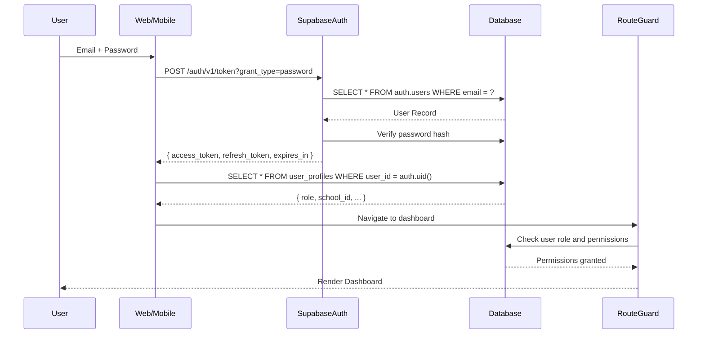
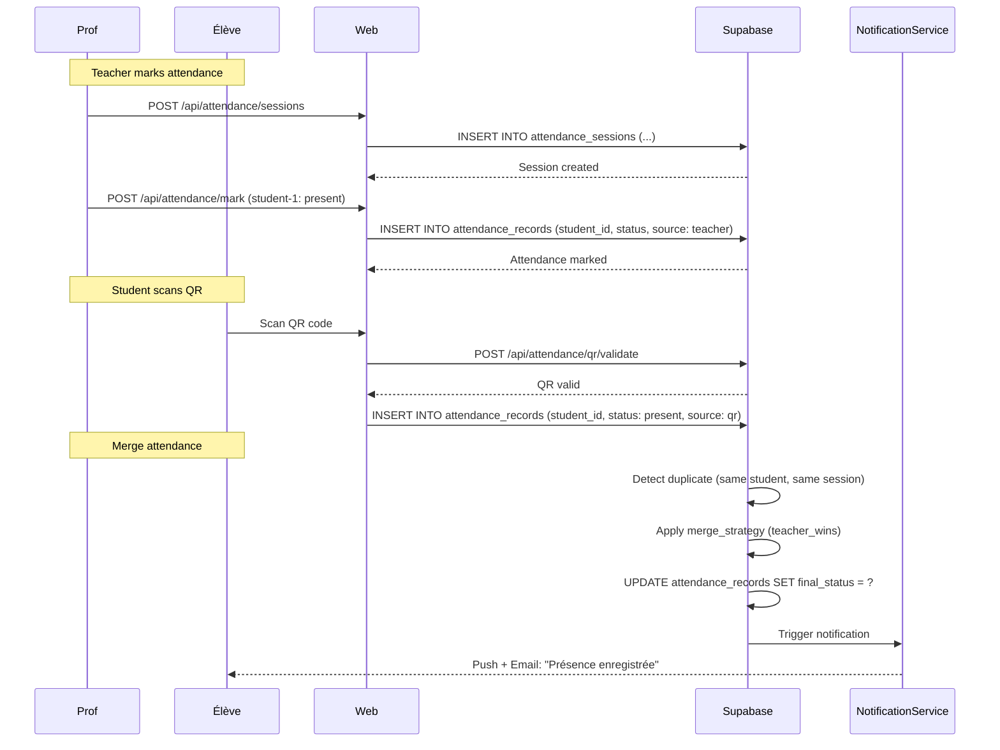
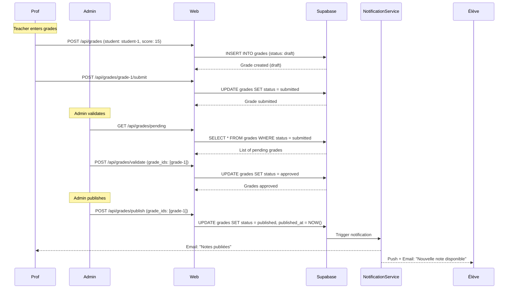
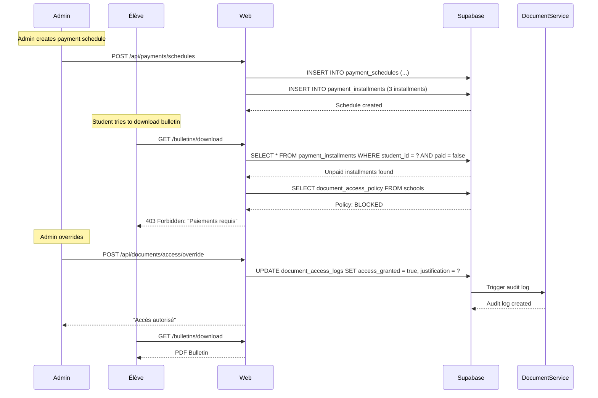
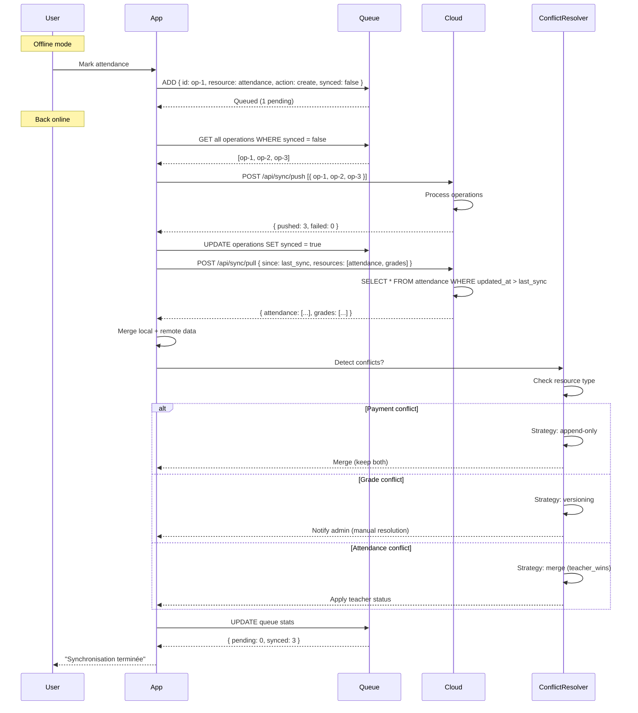
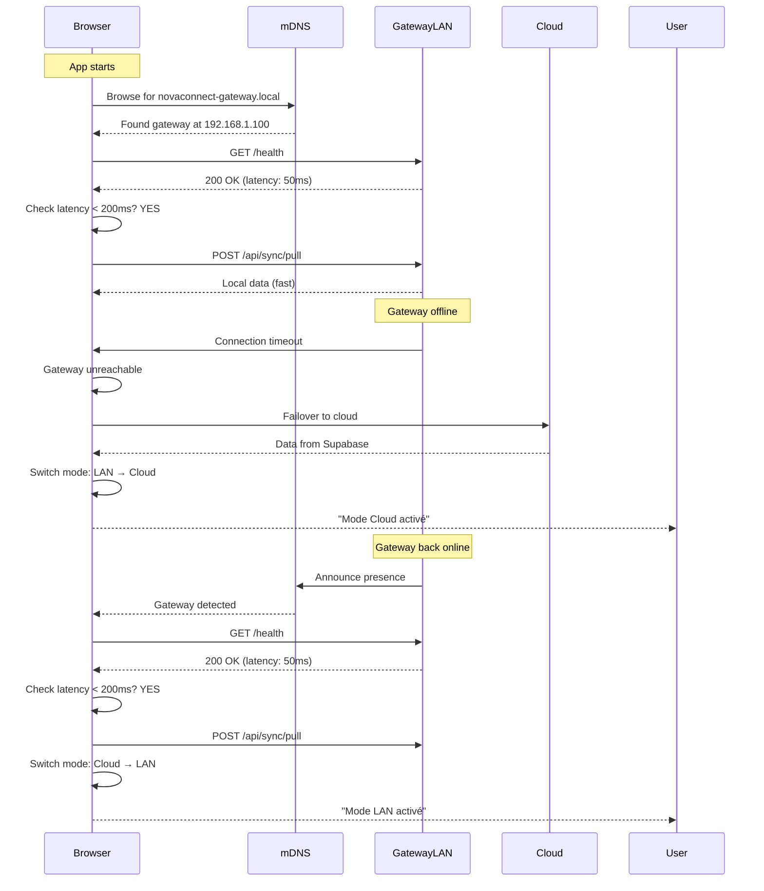
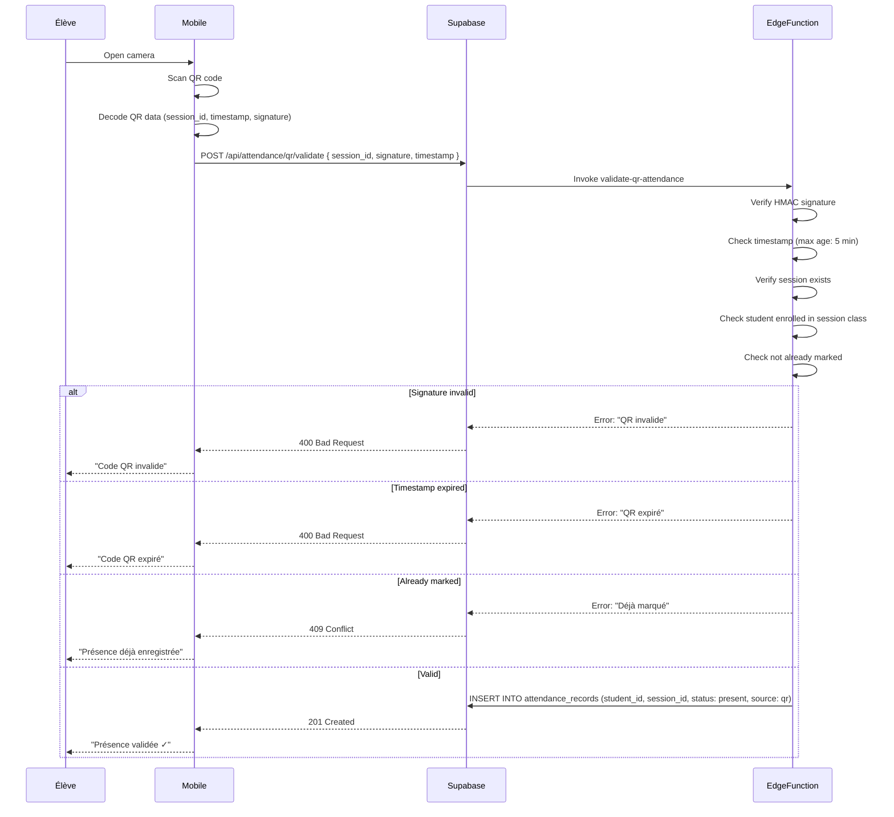
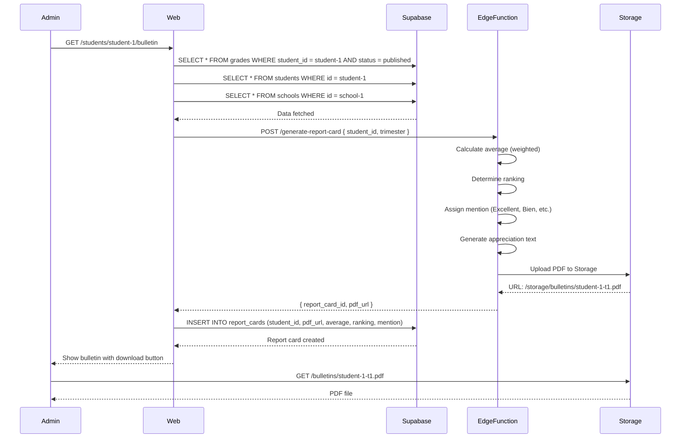
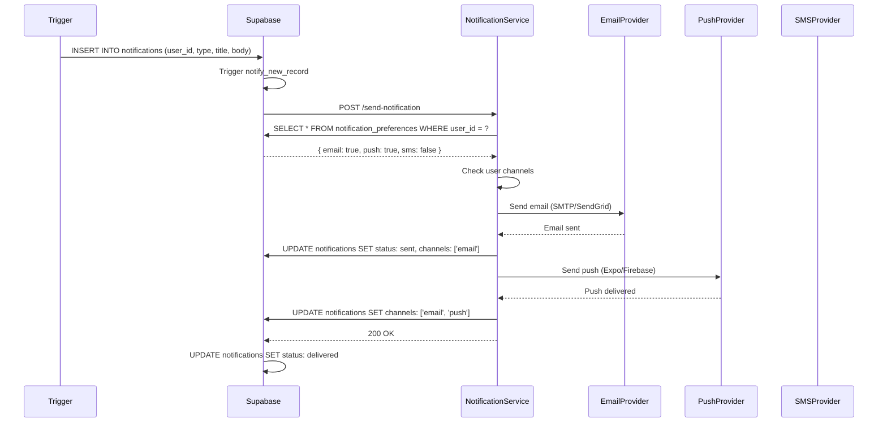
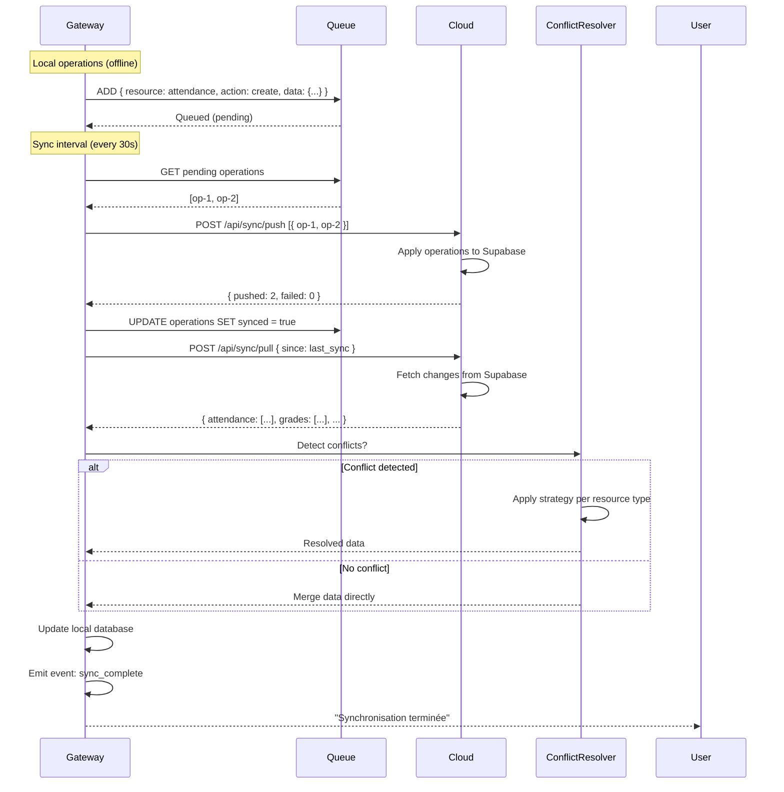

# Diagrammes de Flux - NovaConnect

## 1. Authentification Multi-Rôle

## 2. Présence Prof + QR → Fusion

## 3. Notes: Saisie → Validation → Publication → Notification

## 4. Paiement → Blocage Documents → Override Admin

## 5. Sync Offline: Queue → Push Cloud → Pull Cloud → Conflict Resolution

## 6. Gateway LAN Discovery and Failover

## 7. Présence QR avec Validation Anti-Fraude

## 8. Génération Bulletin de Notes

## 9. Notification Multi-Canal

## 10. Sync Bidirectionnelle Gateway ↔ Cloud

## Conclusion

Ces diagrammes illustrent les flux critiques de NovaConnect :
- Authentification sécurisée multi-rôle
- Présence avec fusion prof/QR
- Cycle de vie des notes
- Gestion des paiements et blocages
- Synchronisation offline
- Découverte et basculement Gateway LAN
- Validation anti-fraude QR
- Génération de bulletins
- Notifications multi-canal
- Sync bidirectionnelle

Chaque flux est optimisé pour :
- Performance (latency minimale)
- Fiabilité (retry, error handling)
- Scalabilité (async, queues)
- Sécurité (validation, audit)
- UX (feedback utilisateur, notifications)
