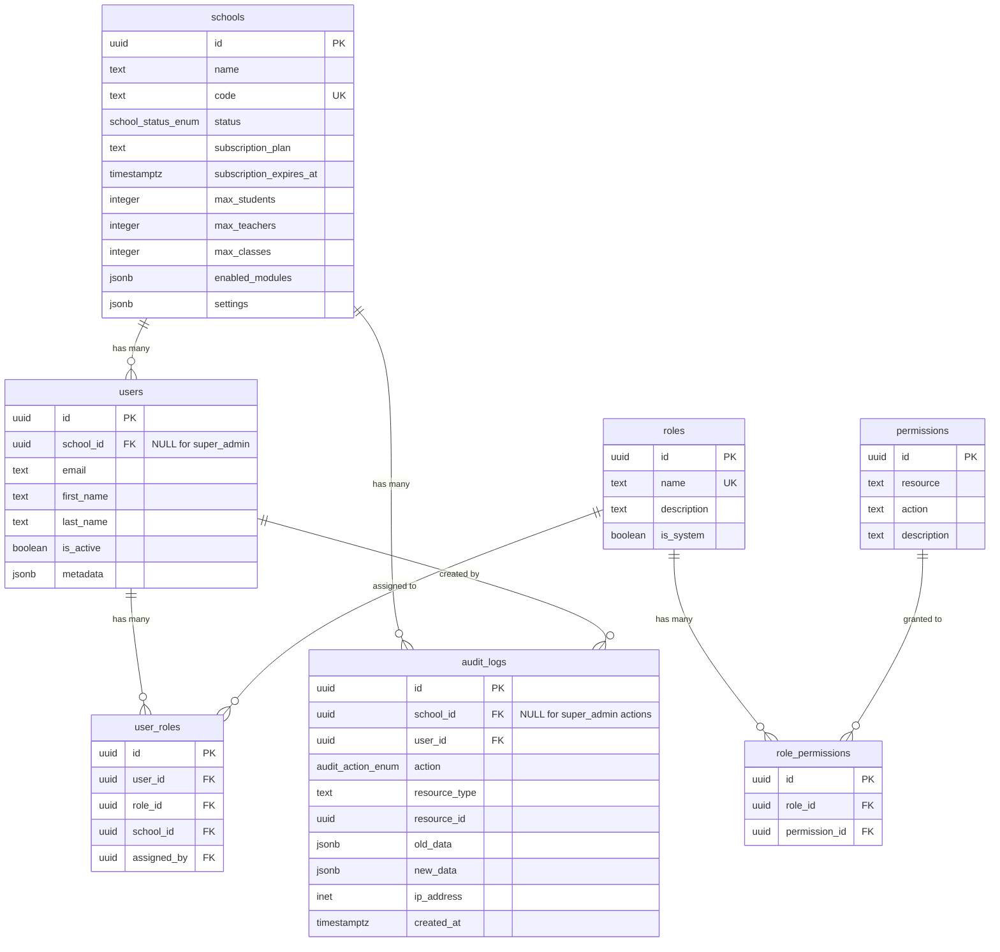
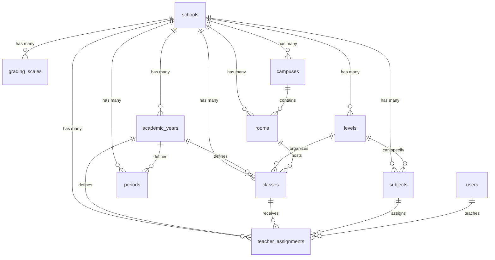

# NovaConnect Database Schema

Complete documentation of the NovaConnect database schema, relationships, and design patterns.

## Entity Relationship Diagram



## Table Descriptions

### schools

**Purpose:** Represents tenant schools/organizations in the multi-tenant system.

| Column | Type | Constraints | Description |
|--------|------|-------------|-------------|
| id | uuid | PK, DEFAULT uuid_generate_v4() | Unique identifier |
| name | text | NOT NULL | School name |
| code | text | UNIQUE, NOT NULL | School code (e.g., "NOUAK-001") |
| address | text | NULLABLE | Physical address |
| city | text | NULLABLE | City |
| country | text | NULLABLE | Country |
| phone | text | NULLABLE | Phone number |
| email | text | NULLABLE | Contact email |
| website | text | NULLABLE | Website URL |
| status | school_status_enum | DEFAULT 'active' | School status |
| logo_url | text | NULLABLE | Logo image URL |
| subscription_plan | text | NULLABLE | Subscription tier |
| subscription_expires_at | timestamptz | NULLABLE | Subscription expiry |
| max_students | integer | NULLABLE | Student limit |
| max_teachers | integer | NULLABLE | Teacher limit |
| max_classes | integer | NULLABLE | Class limit |
| enabled_modules | jsonb | DEFAULT '[]' | Enabled features |
| settings | jsonb | DEFAULT '{}' | School settings |
| created_at | timestamptz | DEFAULT NOW() | Creation timestamp |
| updated_at | timestamptz | DEFAULT NOW() | Last update |

**Indexes:**
- `idx_schools_code` on `code`
- `idx_schools_status` on `status`

**Relationships:**
- One-to-many with `users` (via `users.school_id`)
- One-to-many with `audit_logs` (via `audit_logs.school_id`)

---

### users

**Purpose:** Extended user profiles linked to Supabase Auth.

| Column | Type | Constraints | Description |
|--------|------|-------------|-------------|
| id | uuid | PK, FK → auth.users(id) | Auth user ID |
| school_id | uuid | FK → schools(id), NULLABLE | School (NULL for super_admin) |
| email | text | NOT NULL | User email |
| first_name | text | NOT NULL | First name |
| last_name | text | NOT NULL | Last name |
| phone | text | NULLABLE | Phone number |
| avatar_url | text | NULLABLE | Profile picture URL |
| is_active | boolean | DEFAULT TRUE | Account status |
| metadata | jsonb | DEFAULT '{}' | Additional data |
| created_at | timestamptz | DEFAULT NOW() | Creation timestamp |
| updated_at | timestamptz | DEFAULT NOW() | Last update |

**Indexes:**
- `idx_users_school_id` on `school_id`
- `idx_users_email` on `email`
- `idx_users_is_active` on `is_active`

**Relationships:**
- Many-to-one with `schools` (via `school_id`)
- One-to-many with `user_roles` (via `user_roles.user_id`)
- One-to-many with `audit_logs` (via `audit_logs.user_id`)

**Special Cases:**
- `super_admin` users have `school_id = NULL`
- All other users MUST have a `school_id`

---

### roles

**Purpose:** Defines user roles for RBAC.

| Column | Type | Constraints | Description |
|--------|------|-------------|-------------|
| id | uuid | PK, DEFAULT uuid_generate_v4() | Unique identifier |
| name | text | UNIQUE, NOT NULL | Role name |
| description | text | NULLABLE | Role description |
| is_system | boolean | DEFAULT FALSE | System role flag |
| created_at | timestamptz | DEFAULT NOW() | Creation timestamp |
| updated_at | timestamptz | DEFAULT NOW() | Last update |

**System Roles:**
1. `super_admin` - Full platform access
2. `school_admin` - Full school management
3. `accountant` - Financial operations
4. `teacher` - Teaching, grades, attendance
5. `student` - View own data
6. `parent` - View children data
7. `supervisor` - Validation and supervision

**Relationships:**
- One-to-many with `user_roles` (via `user_roles.role_id`)
- One-to-many with `role_permissions` (via `role_permissions.role_id`)

**Constraints:**
- System roles (`is_system = true`) cannot be deleted
- Custom roles can be created by super_admin only

---

### permissions

**Purpose:** Defines granular permissions for resources.

| Column | Type | Constraints | Description |
|--------|------|-------------|-------------|
| id | uuid | PK, DEFAULT uuid_generate_v4() | Unique identifier |
| resource | text | NOT NULL | Resource name |
| action | text | NOT NULL | Action name |
| description | text | NULLABLE | Permission description |
| created_at | timestamptz | DEFAULT NOW() | Creation timestamp |
| updated_at | timestamptz | DEFAULT NOW() | Last update |

**Unique Constraint:** `(resource, action)`

**Permission Format:** `{resource}:{action}`

**Examples:**
- `schools:create` - Create schools
- `grades:validate` - Validate grades
- `reports:export` - Export reports

**Relationships:**
- One-to-many with `role_permissions` (via `role_permissions.permission_id`)

---

### role_permissions

**Purpose:** Junction table linking roles to permissions (many-to-many).

| Column | Type | Constraints | Description |
|--------|------|-------------|-------------|
| id | uuid | PK, DEFAULT uuid_generate_v4() | Unique identifier |
| role_id | uuid | FK → roles(id), NOT NULL | Role ID |
| permission_id | uuid | FK → permissions(id), NOT NULL | Permission ID |
| created_at | timestamptz | DEFAULT NOW() | Creation timestamp |

**Unique Constraint:** `(role_id, permission_id)`

**Relationships:**
- Many-to-one with `roles` (via `role_id`)
- Many-to-one with `permissions` (via `permission_id`)

---

### user_roles

**Purpose:** Junction table linking users to roles with school context.

| Column | Type | Constraints | Description |
|--------|------|-------------|-------------|
| id | uuid | PK, DEFAULT uuid_generate_v4() | Unique identifier |
| user_id | uuid | FK → users(id), NOT NULL | User ID |
| role_id | uuid | FK → roles(id), NOT NULL | Role ID |
| school_id | uuid | FK → schools(id), NULLABLE | School context |
| assigned_by | uuid | FK → users(id), NULLABLE | Who assigned the role |
| assigned_at | timestamptz | DEFAULT NOW() | Assignment timestamp |

**Unique Constraint:** `(user_id, role_id, school_id)`

**Relationships:**
- Many-to-one with `users` (via `user_id`)
- Many-to-one with `roles` (via `role_id`)
- Many-to-one with `schools` (via `school_id`)
- Many-to-one with `users` (via `assigned_by`)

**Important:**
- A user can have the same role in different schools
- `school_id` provides context for role assignment
- `assigned_by` tracks who granted the role (audit trail)

---

### audit_logs

**Purpose:** Comprehensive audit trail for all critical actions.

| Column | Type | Constraints | Description |
|--------|------|-------------|-------------|
| id | uuid | PK, DEFAULT uuid_generate_v4() | Unique identifier |
| school_id | uuid | FK → schools(id), NULLABLE | School (NULL for super_admin) |
| user_id | uuid | FK → users(id), NULLABLE | User who performed action |
| action | audit_action_enum | NOT NULL | Action type |
| resource_type | text | NOT NULL | Resource affected |
| resource_id | uuid | NULLABLE | Specific resource ID |
| old_data | jsonb | NULLABLE | Data before change |
| new_data | jsonb | NULLABLE | Data after change |
| ip_address | inet | NULLABLE | Client IP address |
| user_agent | text | NULLABLE | Client user agent |
| metadata | jsonb | DEFAULT '{}' | Additional metadata |
| created_at | timestamptz | DEFAULT NOW() | When action occurred |

**Audit Actions:**
- `INSERT` - Row created
- `UPDATE` - Row modified
- `DELETE` - Row deleted
- `LOGIN` - User logged in
- `LOGOUT` - User logged out
- `EXPORT` - Data exported
- `VALIDATE` - Data validated

**Indexes:**
- `idx_audit_logs_school_id` on `school_id`
- `idx_audit_logs_user_id` on `user_id`
- `idx_audit_logs_created_at` on `created_at DESC`
- `idx_audit_logs_resource_type` on `resource_type`
- `idx_audit_logs_resource_id` on `resource_id`

**Relationships:**
- Many-to-one with `schools` (via `school_id`)
- Many-to-one with `users` (via `user_id`)

**Automatic Logging:**
Triggers automatically log all INSERT/UPDATE/DELETE on:
- `schools`
- `users`
- `user_roles`

**Manual Logging:**
Use custom functions for LOGIN, LOGOUT, EXPORT, VALIDATE.

---

## Data Types

### Enums

#### user_role_enum
```sql
' super_admin '
' school_admin '
' accountant '
' teacher '
' student '
' parent '
' supervisor '
```

#### school_status_enum
```sql
' active '
' suspended '
' archived '
```

#### audit_action_enum
```sql
' INSERT '
' UPDATE '
' DELETE '
' LOGIN '
' LOGOUT '
' EXPORT '
' VALIDATE '
```

### JSONB Columns

#### schools.enabled_modules
Array of enabled features:
```json
["qr_attendance", "mobile_money", "exam_mode", "multi_campus", "api_export"]
```

#### schools.settings
School-specific configuration:
```json
{
  "academic_year": "2024-2025",
  "currency": "MRU",
  "timezone": "Africa/Nouakchott",
  "language": "fr"
}
```

#### users.metadata
User-specific metadata:
```json
{
  "preferences": {
    "theme": "dark",
    "language": "fr"
  },
  "notifications": {
    "email": true,
    "push": false
  }
}
```

#### audit_logs.old_data / new_data
Snapshot of row before/after change:
```json
{
  "id": "uuid",
  "name": "Old School Name",
  "status": "active",
  "updated_at": "2024-01-15T10:30:00Z"
}
```

---

## Performance Considerations

### Index Strategy

All foreign keys are indexed for JOIN performance:
- `schools.id` (Primary Key)
- `users.school_id`
- `user_roles.user_id`, `user_roles.role_id`, `user_roles.school_id`
- `role_permissions.role_id`, `role_permissions.permission_id`
- `audit_logs.school_id`, `audit_logs.user_id`, `audit_logs.resource_id`

Frequently queried columns:
- `schools.code`, `schools.status`
- `users.email`, `users.is_active`
- `audit_logs.created_at` (DESC for sorting)

### Query Optimization

**Use Indexes:**
```sql
-- ✅ GOOD: Uses index
SELECT * FROM users WHERE email = 'user@example.com';

-- ❌ BAD: Function call prevents index use
SELECT * FROM users WHERE LOWER(email) = 'user@example.com';
```

**Join Strategy:**
```sql
-- Use JOIN instead of subqueries when possible
SELECT u.*, r.name as role_name
FROM users u
JOIN user_roles ur ON ur.user_id = u.id
JOIN roles r ON r.id = ur.role_id
WHERE u.school_id = 'school-uuid';
```

**Pagination:**
```sql
-- Use LIMIT/OFFSET or cursor-based pagination
SELECT * FROM audit_logs
ORDER BY created_at DESC
LIMIT 50 OFFSET 0;
```

---

## Data Integrity

### Constraints

**Foreign Keys:**
- All relationships enforced with FK constraints
- `ON DELETE CASCADE` for dependent rows
- `ON DELETE SET NULL` for optional relationships

**Unique Constraints:**
- `schools.code` - No duplicate school codes
- `roles.name` - No duplicate role names
- `permissions(resource, action)` - No duplicate permissions
- `user_roles(user_id, role_id, school_id)` - One role per user per school

**Check Constraints:**
- Enums ensure valid values
- NOT NULL on required fields
- DEFAULT values for timestamps

### Cascading Deletes

- Deleting a school → Deletes all users in that school
- Deleting a user → Deletes all their role assignments
- Deleting a role → Deletes all role-permission associations
- Deleting a permission → Deletes all role-permission associations

---

## Migration Strategy

When adding new tables or columns:

1. **Create migration** with proper indexes and constraints
2. **Add RLS policies** for multi-tenant isolation
3. **Add audit triggers** if table is sensitive
4. **Update TypeScript types** (`pnpm db:types`)
5. **Update helpers and queries** in `packages/data`
6. **Test thoroughly** before deploying

---

## Additional Resources

- [Supabase Schema Design](https://supabase.com/docs/guides/database/schema-design)
- [PostgreSQL Performance](https://www.postgresql.org/docs/current/performance-tips.html)
- [Indexing Strategies](https://www.postgresql.org/docs/current/indexes.html)
- [JSONB in PostgreSQL](https://www.postgresql.org/docs/current/datatype-json.html)

---

## School Configuration Tables

The following tables provide foundational configuration for academic structure, serving as the basis for scheduling, grading, and attendance modules.

### ERD for School Configuration



### academic_years

**Purpose:** Defines academic years for a school (e.g., "2024-2025").

| Column | Type | Constraints | Description |
|--------|------|-------------|-------------|
| id | uuid | PK, DEFAULT gen_random_uuid() | Unique identifier |
| school_id | uuid | FK → schools(id), NOT NULL | School |
| name | text | NOT NULL, UNIQUE (school_id, name) | Display name (e.g., "2024-2025") |
| start_date | date | NOT NULL | First day of academic year |
| end_date | date | NOT NULL | Last day of academic year |
| is_current | boolean | DEFAULT FALSE | Currently active year |
| created_at | timestamptz | DEFAULT NOW() | Creation timestamp |
| updated_at | timestamptz | DEFAULT NOW() | Last update |

**Constraints:**
- `end_date > start_date`
- Only ONE year per school can have `is_current = true` (enforced by trigger)

**Business Logic Triggers:**
- `ensure_single_current_academic_year` - Ensures only one current year per school
- `prevent_delete_current_academic_year` - Prevents deletion of current year
- `prevent_delete_academic_year_with_classes` - Prevents deletion if has dependencies

**Indexes:**
- `idx_academic_years_school_id` on `school_id`
- `idx_academic_years_is_current` on `is_current` WHERE `is_current = true`
- `idx_academic_years_dates` on `(start_date, end_date)`

---

### levels

**Purpose:** Educational levels within a school (e.g., "6ème", "Terminale S", "Licence 1").

| Column | Type | Constraints | Description |
|--------|------|-------------|-------------|
| id | uuid | PK, DEFAULT gen_random_uuid() | Unique identifier |
| school_id | uuid | FK → schools(id), NOT NULL | School |
| name | text | NOT NULL | Level name (e.g., "6ème") |
| code | text | NOT NULL, UNIQUE (school_id, code) | Short code (e.g., "6EME") |
| level_type | level_type_enum | NOT NULL | Type: primary, middle_school, high_school, university |
| order_index | integer | NOT NULL, DEFAULT 0 | Sorting order |
| created_at | timestamptz | DEFAULT NOW() | Creation timestamp |
| updated_at | timestamptz | DEFAULT NOW() | Last update |

**Business Logic Triggers:**
- `prevent_delete_level_with_classes` - Prevents deletion if has associated classes

**Indexes:**
- `idx_levels_school_id` on `school_id`
- `idx_levels_level_type` on `level_type`
- `idx_levels_order` on `order_index`

---

### classes

**Purpose:** Student groups/cohorts for a specific academic year (e.g., "6ème A", "TS1").

| Column | Type | Constraints | Description |
|--------|------|-------------|-------------|
| id | uuid | PK, DEFAULT gen_random_uuid() | Unique identifier |
| school_id | uuid | FK → schools(id), NOT NULL | School |
| level_id | uuid | FK → levels(id), NOT NULL | Educational level |
| academic_year_id | uuid | FK → academic_years(id), NOT NULL | Academic year |
| name | text | NOT NULL | Class name (e.g., "6ème A") |
| code | text | NOT NULL, UNIQUE (school_id, academic_year_id, code) | Short code (e.g., "6EMEA") |
| capacity | integer | NULLABLE, POSITIVE | Max students |
| homeroom_teacher_id | uuid | FK → users(id), NULLABLE | Professeur principal |
| room_id | uuid | FK → rooms(id), NULLABLE | Default room |
| metadata | jsonb | DEFAULT '{}' | Additional info |
| created_at | timestamptz | DEFAULT NOW() | Creation timestamp |
| updated_at | timestamptz | DEFAULT NOW() | Last update |

**metadata Example:**
```json
{
  "double_streaming": true,
  "special_program": "bilingual",
  "options": ["maths", "physics"]
}
```

**Indexes:**
- `idx_classes_school_id` on `school_id`
- `idx_classes_level_id` on `level_id`
- `idx_classes_academic_year_id` on `academic_year_id`
- `idx_classes_homeroom_teacher_id` on `homeroom_teacher_id` WHERE NOT NULL
- `idx_classes_room_id` on `room_id` WHERE NOT NULL

---

### subjects

**Purpose:** Subjects taught in the school (e.g., "Mathématiques", "Français").

| Column | Type | Constraints | Description |
|--------|------|-------------|-------------|
| id | uuid | PK, DEFAULT gen_random_uuid() | Unique identifier |
| school_id | uuid | FK → schools(id), NOT NULL | School |
| name | text | NOT NULL | Subject name (e.g., "Mathématiques") |
| code | text | NOT NULL, UNIQUE (school_id, code) | Short code (e.g., "MATHS") |
| description | text | NULLABLE | Subject description |
| level_id | uuid | FK → levels(id), NULLABLE | Specific level (NULL if all levels) |
| coefficient | decimal(3,2) | DEFAULT 1.00, POSITIVE | Weight for GPA calculation |
| color | text | NULLABLE, HEX color | UI display color (e.g., "#3b82f6") |
| icon | text | NULLABLE | Icon name or emoji (e.g., "📐") |
| is_active | boolean | DEFAULT TRUE | Active status (soft delete) |
| created_at | timestamptz | DEFAULT NOW() | Creation timestamp |
| updated_at | timestamptz | DEFAULT NOW() | Last update |

**Business Logic Triggers:**
- `prevent_delete_subject_with_assignments` - Prevents deletion if has teacher assignments

**Indexes:**
- `idx_subjects_school_id` on `school_id`
- `idx_subjects_level_id` on `level_id` WHERE NOT NULL
- `idx_subjects_is_active` on `is_active` WHERE `is_active = true`

---

### periods

**Purpose:** Academic periods within a year (trimesters, semesters, exams).

| Column | Type | Constraints | Description |
|--------|------|-------------|-------------|
| id | uuid | PK, DEFAULT gen_random_uuid() | Unique identifier |
| school_id | uuid | FK → schools(id), NOT NULL | School |
| academic_year_id | uuid | FK → academic_years(id), NOT NULL | Academic year |
| name | text | NOT NULL, UNIQUE (school_id, academic_year_id, name) | Period name (e.g., "Trimestre 1") |
| period_type | period_type_enum | NOT NULL | Type: trimester, semester, composition, exam |
| start_date | date | NOT NULL | Period start |
| end_date | date | NOT NULL | Period end |
| order_index | integer | NOT NULL, DEFAULT 0 | Sorting order |
| weight | decimal(3,2) | DEFAULT 1.00, POSITIVE | Weight for final grade |
| created_at | timestamptz | DEFAULT NOW() | Creation timestamp |
| updated_at | timestamptz | DEFAULT NOW() | Last update |

**Constraints:**
- `end_date > start_date`

**Indexes:**
- `idx_periods_school_id` on `school_id`
- `idx_periods_academic_year_id` on `academic_year_id`
- `idx_periods_period_type` on `period_type`
- `idx_periods_dates` on `(start_date, end_date)`

---

### grading_scales

**Purpose:** Grading scales with score ranges and honor mentions.

| Column | Type | Constraints | Description |
|--------|------|-------------|-------------|
| id | uuid | PK, DEFAULT gen_random_uuid() | Unique identifier |
| school_id | uuid | FK → schools(id), NOT NULL | School |
| name | text | NOT NULL | Scale name (e.g., "Standard 0-20") |
| min_score | decimal(5,2) | DEFAULT 0 | Minimum possible score |
| max_score | decimal(5,2) | DEFAULT 20 | Maximum possible score |
| passing_score | decimal(5,2) | DEFAULT 10 | Minimum passing score |
| scale_config | jsonb | NOT NULL, DEFAULT '{}' | Mentions, thresholds, colors |
| is_default | boolean | DEFAULT FALSE | Default scale for school |
| created_at | timestamptz | DEFAULT NOW() | Creation timestamp |
| updated_at | timestamptz | DEFAULT NOW() | Last update |

**Constraints:**
- `passing_score >= min_score AND passing_score <= max_score`
- `max_score > min_score`
- Only ONE scale per school can have `is_default = true` (enforced by trigger)

**scale_config Example:**
```json
{
  "mentions": [
    {"min": 16, "max": 20, "label": "Très Bien", "color": "#10b981"},
    {"min": 14, "max": 16, "label": "Bien", "color": "#3b82f6"},
    {"min": 12, "max": 14, "label": "Assez Bien", "color": "#f59e0b"},
    {"min": 10, "max": 12, "label": "Passable", "color": "#6b7280"},
    {"min": 0, "max": 10, "label": "Insuffisant", "color": "#ef4444"}
  ]
}
```

**Business Logic Triggers:**
- `ensure_single_default_grading_scale` - Ensures only one default scale per school
- `prevent_delete_default_grading_scale` - Prevents deletion of default scale

**Indexes:**
- `idx_grading_scales_school_id` on `school_id`
- `idx_grading_scales_is_default` on `is_default` WHERE `is_default = true`

---

### campuses

**Purpose:** Physical locations/campuses belonging to a school.

| Column | Type | Constraints | Description |
|--------|------|-------------|-------------|
| id | uuid | PK, DEFAULT gen_random_uuid() | Unique identifier |
| school_id | uuid | FK → schools(id), NOT NULL | School |
| name | text | NOT NULL | Campus name (e.g., "Campus Principal") |
| code | text | NOT NULL, UNIQUE (school_id, code) | Short code (e.g., "MAIN") |
| address | text | NULLABLE | Street address |
| city | text | NULLABLE | City |
| latitude | decimal(9,6) | NULLABLE, -90 to 90 | GPS latitude |
| longitude | decimal(9,6) | NULLABLE, -180 to 180 | GPS longitude |
| radius_meters | integer | DEFAULT 200, POSITIVE | Geofencing radius |
| is_main | boolean | DEFAULT FALSE | Main campus flag |
| created_at | timestamptz | DEFAULT NOW() | Creation timestamp |
| updated_at | timestamptz | DEFAULT NOW() | Last update |

**Constraints:**
- `latitude BETWEEN -90 AND 90`
- `longitude BETWEEN -180 AND 180`
- Only ONE campus per school can have `is_main = true` (enforced by trigger)

**Business Logic Triggers:**
- `ensure_single_main_campus` - Ensures only one main campus per school
- `prevent_delete_main_campus` - Prevents deletion of main campus
- `prevent_delete_campus_with_rooms` - Prevents deletion if has rooms

**Indexes:**
- `idx_campuses_school_id` on `school_id`
- `idx_campuses_is_main` on `is_main` WHERE `is_main = true`
- `idx_campuses_location` on `(latitude, longitude)` WHERE both NOT NULL

---

### rooms

**Purpose:** Rooms within campuses (classrooms, labs, amphitheaters).

| Column | Type | Constraints | Description |
|--------|------|-------------|-------------|
| id | uuid | PK, DEFAULT gen_random_uuid() | Unique identifier |
| school_id | uuid | FK → schools(id), NOT NULL | School |
| campus_id | uuid | FK → campuses(id), NOT NULL | Campus |
| name | text | NOT NULL | Room name (e.g., "Salle 101") |
| code | text | NOT NULL, UNIQUE (school_id, campus_id, code) | Short code (e.g., "101") |
| capacity | integer | NULLABLE, POSITIVE | Max occupants |
| room_type | room_type_enum | DEFAULT 'classroom' | Type: classroom, lab, amphitheater, library, gym, other |
| equipment | jsonb | DEFAULT '{}' | Available equipment |
| is_available | boolean | DEFAULT TRUE | Available for scheduling |
| created_at | timestamptz | DEFAULT NOW() | Creation timestamp |
| updated_at | timestamptz | DEFAULT NOW() | Last update |

**equipment Example:**
```json
{
  "projector": true,
  "computers": 20,
  "smart_board": true,
  "chemistry_hood": false
}
```

**Indexes:**
- `idx_rooms_school_id` on `school_id`
- `idx_rooms_campus_id` on `campus_id`
- `idx_rooms_room_type` on `room_type`
- `idx_rooms_is_available` on `is_available` WHERE `is_available = true`

---

### teacher_assignments

**Purpose:** Assigns teachers to classes and subjects for an academic year.

| Column | Type | Constraints | Description |
|--------|------|-------------|-------------|
| id | uuid | PK, DEFAULT gen_random_uuid() | Unique identifier |
| school_id | uuid | FK → schools(id), NOT NULL | School |
| teacher_id | uuid | FK → users(id), NOT NULL | Teacher (must have role='teacher') |
| class_id | uuid | FK → classes(id), NOT NULL | Class being taught |
| subject_id | uuid | FK → subjects(id), NOT NULL | Subject being taught |
| academic_year_id | uuid | FK → academic_years(id), NOT NULL | Academic year |
| is_primary | boolean | DEFAULT FALSE | Primary teacher for this subject |
| hourly_rate | decimal(10,2) | NULLABLE, POSITIVE | Hourly rate for payroll |
| assigned_at | timestamptz | DEFAULT NOW() | Assignment timestamp |
| created_at | timestamptz | DEFAULT NOW() | Creation timestamp |
| updated_at | timestamptz | DEFAULT NOW() | Last update |

**Constraints:**
- UNIQUE `(school_id, teacher_id, class_id, subject_id, academic_year_id)`
- CHECK: `teacher_id` must reference a user with `role = 'teacher'`

**Business Logic Triggers:**
- `validate_teacher_role_on_assignment` - Ensures teacher_id references a teacher

**Indexes:**
- `idx_teacher_assignments_school_id` on `school_id`
- `idx_teacher_assignments_teacher_id` on `teacher_id`
- `idx_teacher_assignments_class_id` on `class_id`
- `idx_teacher_assignments_subject_id` on `subject_id`
- `idx_teacher_assignments_academic_year_id` on `academic_year_id`
- `idx_teacher_assignments_assigned_at` on `assigned_at`

---

### Enums

#### level_type_enum
```sql
'primary'
'middle_school'
'high_school'
'university'
```

#### period_type_enum
```sql
'trimester'
'semester'
'composition'
'exam'
```

#### room_type_enum
```sql
'classroom'
'lab'
'amphitheater'
'library'
'gym'
'other'
```

---

## Common Use Cases

### Create a New Academic Year
```sql
INSERT INTO academic_years (school_id, name, start_date, end_date, is_current)
VALUES ('school-uuid', '2025-2026', '2025-09-01', '2026-07-31', false);

-- Set as current
UPDATE academic_years SET is_current = false WHERE school_id = 'school-uuid';
UPDATE academic_years SET is_current = true WHERE id = 'new-year-uuid';
```

### Get All Classes for Current Academic Year
```sql
SELECT c.*, l.name as level_name, u.first_name || ' ' || u.last_name as homeroom_teacher
FROM classes c
JOIN levels l ON l.id = c.level_id
LEFT JOIN users u ON u.id = c.homeroom_teacher_id
JOIN academic_years ay ON ay.id = c.academic_year_id
WHERE c.school_id = 'school-uuid'
  AND ay.is_current = true
ORDER BY c.name;
```

### Get Teacher Schedule
```sql
SELECT ta.*, c.name as class_name, s.name as subject_name, u.first_name || ' ' || u.last_name as teacher_name
FROM teacher_assignments ta
JOIN classes c ON c.id = ta.class_id
JOIN subjects s ON s.id = ta.subject_id
JOIN users u ON u.id = ta.teacher_id
WHERE ta.teacher_id = 'teacher-uuid'
  AND ta.academic_year_id = (SELECT id FROM academic_years WHERE is_current = true AND school_id = 'school-uuid')
ORDER BY c.name, s.name;
```

### Calculate Student GPA with Weights
```sql
WITH period_grades AS (
  SELECT
    g.student_id,
    g.subject_id,
    AVG((g.score / g.max_score) * s.coefficient) as weighted_avg,
    p.weight as period_weight
  FROM grades g
  JOIN subjects s ON s.id = g.subject_id
  JOIN periods p ON p.id = g.period_id
  WHERE g.student_id = 'student-uuid'
    AND g.academic_year_id = 'current-year-uuid'
  GROUP BY g.student_id, g.subject_id, p.weight
)
SELECT
  student_id,
  SUM(weighted_avg * period_weight) / SUM(period_weight) as gpa
FROM period_grades
GROUP BY student_id;
```

---

## Additional Resources

- [Academic Year Management](https://supabase.com/docs/guides/database/postgres/columns#enums)
- [Multi-Tenancy Patterns](https://supabase.com/docs/guides/auth/row-level-security#policies)
- [JSONB for Flexible Configuration](https://www.postgresql.org/docs/current/datatype-json.html)

