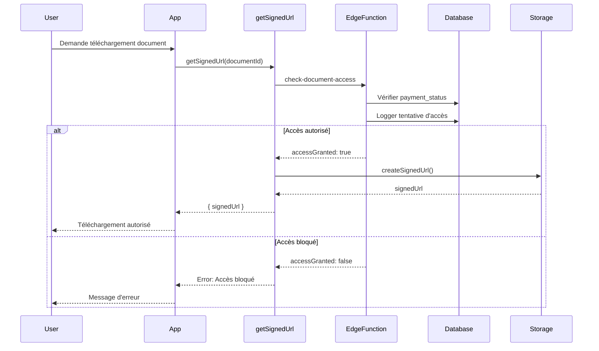

# Système de blocage de documents conditionné par paiements

## Vue d'ensemble

Le système de blocage de documents permet de restreindre l'accès aux documents scolaires (bulletins, certificats, cartes, autorisations) en fonction du statut de paiement de l'élève.

## Architecture

### Flux de vérification



## Configuration

### Paramètres école (school_settings)

```typescript
paymentBlocking: {
  mode: 'OK' | 'WARNING' | 'BLOCKED',
  blockBulletins: boolean,
  blockCertificates: boolean,
  blockStudentCards: boolean,
  blockExamAuthorizations: boolean,
  warningThresholdPercent: number
}
```

### Statuts de paiement

- **ok** : Aucun arriéré, accès complet
- **warning** : Arriérés mineurs, avertissement affiché
- **blocked** : Arriérés importants, accès bloqué

## Déblocage administrateur

Les administrateurs peuvent débloquer l'accès avec justification obligatoire :

1. Accéder à `/admin/documents/blocked`
2. Sélectionner le document à débloquer
3. Fournir une justification (min 10 caractères)
4. Confirmer le déblocage

L'action est enregistrée dans l'audit log avec :
- Qui a débloqué
- Quand
- Pourquoi (justification)

## Audit et traçabilité

Toutes les tentatives d'accès sont enregistrées dans `document_access_logs` :
- Accès autorisés et refusés
- Statut de paiement au moment de l'accès
- Overrides administrateurs
- IP et user agent

## Extension à d'autres documents

Pour ajouter un nouveau type de document :

1. Ajouter le type dans `documentTypeSchema`
2. Ajouter la configuration dans `paymentBlockingConfigSchema`
3. Implémenter la vérification dans `check-document-access`
4. Créer la query avec vérification d'accès
5. Mettre à jour l'UI mobile/web

## Notifications

Les parents reçoivent une notification lorsque :
- Un document est bloqué pour la première fois
- Un document est débloqué par un admin
- Le statut de paiement change

Canaux : in-app, push, email/SMS (selon configuration).

## Fichiers implémentés

### Base de données
- `supabase/migrations/20250128000001_create_document_access_logs.sql` - Table d'audit
- `supabase/migrations/20250128000002_create_document_blocked_trigger.sql` - Trigger notifications

### Edge Functions
- `supabase/functions/check-document-access/index.ts` - Vérification accès centralisée
- `supabase/functions/notify-document-blocked/index.ts` - Notifications parents
- `supabase/functions/generate-report-card-pdf/index.ts` - Génération PDF avec statut paiement

### Core Package
- `packages/core/src/utils/documentAccess.ts` - Helpers vérification accès
- `packages/core/src/schemas/documentAccess.ts` - Schémas TypeScript Zod

### Data Package
- `packages/data/src/queries/documentAccessLogs.ts` - Queries audit logs
- `packages/data/src/hooks/useDocumentAccessLogs.ts` - Hooks React Query
- `packages/data/src/queries/reportCards.ts` - Modification getSignedUrl avec vérification

### Mobile App
- `apps/mobile/app/report-cards.tsx` - UI liste avec indicateurs blocage
- `apps/mobile/app/report-cards/[id].tsx` - UI détail avec contrôle téléchargement

### Web App Admin
- `apps/web/src/app/(dashboard)/admin/documents/blocked/page.tsx` - Page gestion
- `apps/web/src/app/(dashboard)/admin/documents/blocked/components/OverrideDialog.tsx` - Modal déblocage
- `apps/web/src/components/layout/Sidebar.tsx` - Lien navigation admin

## Checklist de déploiement

- [ ] Exécuter migration `20250128000001_create_document_access_logs.sql`
- [ ] Exécuter migration `20250128000002_create_document_blocked_trigger.sql`
- [ ] Déployer Edge Function `check-document-access`
- [ ] Déployer Edge Function `notify-document-blocked`
- [ ] Mettre à jour `generate-report-card-pdf` pour inclure payment_status
- [ ] Tester le flux complet en dev
- [ ] Vérifier les RLS policies
- [ ] Tester les notifications
- [ ] Valider l'UI mobile (iOS + Android)
- [ ] Valider l'UI web admin
- [ ] Documenter pour les utilisateurs finaux
- [ ] Former les administrateurs sur les overrides
