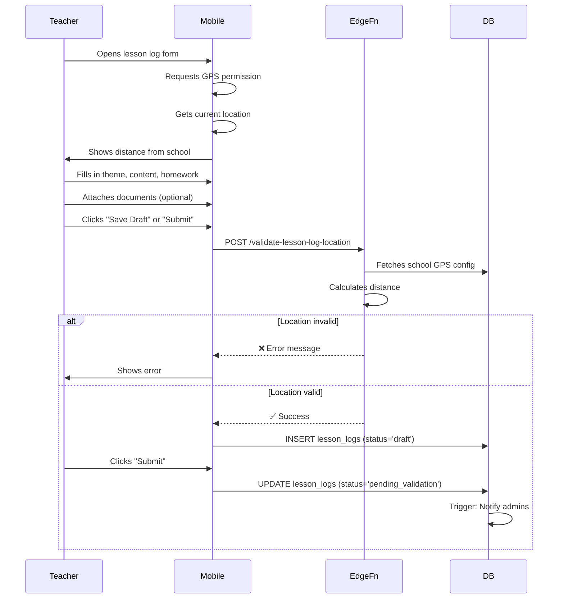
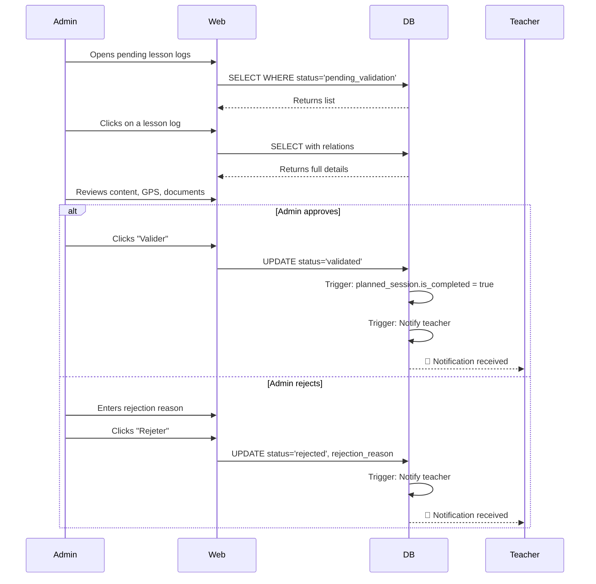
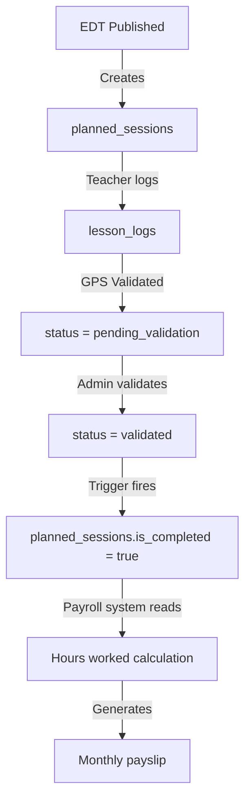

# Lesson Log System (Cahier de Texte Géolocalisé)

## Overview

The Lesson Log System is a comprehensive geolocated lesson log (cahier de texte) feature that integrates with NovaConnect's existing scheduling, attendance, and payroll systems. It enables teachers to log lesson content, validates their location via GPS/Wi-Fi, and automatically links validated lessons to payable hours.

## Table of Contents

- [Architecture](#architecture)
- [Database Schema](#database-schema)
- [Workflow](#workflow)
- [Geolocation Validation](#geolocation-validation)
- [Integration with Payroll](#integration-with-payroll)
- [APIs and Edge Functions](#apis-and-edge-functions)
- [User Interfaces](#user-interfaces)
- [Permissions and Security](#permissions-and-security)
- [Configuration](#configuration)

---

## Architecture

The Lesson Log System consists of three main layers:

### 1. Backend Layer
- **Database Tables**: `lesson_logs` and `lesson_log_documents`
- **Storage Bucket**: `lesson-documents` for file uploads
- **Edge Functions**: `validate-lesson-log-location` for GPS validation
- **Triggers**: Automatic audit logging, planned session completion, and notifications

### 2. Business Logic Layer
- **Zod Schemas**: Type-safe input validation
- **Supabase Queries**: CRUD operations, filtering, and statistics
- **React Hooks**: Data fetching and mutations with cache invalidation

### 3. UI Layer
- **Teacher Mobile App**: Lesson log creation and editing with GPS validation
- **Admin Web Interface**: Validation workflow, hour tracking, statistics
- **Student/Parent Mobile App**: View validated lesson logs and homework

---

## Database Schema

### Tables

#### `lesson_logs`

Main table storing lesson log entries.

| Column | Type | Description |
|--------|------|-------------|
| `id` | UUID | Primary key |
| `school_id` | UUID | FK → schools |
| `planned_session_id` | UUID | FK → planned_sessions |
| `teacher_id` | UUID | FK → users |
| `class_id` | UUID | FK → classes |
| `subject_id` | UUID | FK → subjects |
| `session_date` | DATE | Date of the session |
| `theme` | VARCHAR(200) | Theme/topic of the lesson |
| `content` | TEXT | Detailed content (min 10 chars) |
| `homework` | TEXT | Homework assigned (optional) |
| `duration_minutes` | INTEGER | Duration in minutes (15-300) |
| `status` | ENUM | draft, pending_validation, validated, rejected |
| `submitted_at` | TIMESTAMPTZ | Submission timestamp |
| `validated_at` | TIMESTAMPTZ | Validation timestamp |
| `validated_by` | UUID | FK → users (admin who validated) |
| `rejected_at` | TIMESTAMPTZ | Rejection timestamp |
| `rejection_reason` | TEXT | Reason for rejection |
| `latitude` | DECIMAL(10,8) | GPS latitude |
| `longitude` | DECIMAL(11,8) | GPS longitude |
| `wifi_ssid` | VARCHAR(100) | WiFi SSID (if required) |
| `device_info` | JSONB | Device metadata |
| `metadata` | JSONB | Additional data |
| `created_at` | TIMESTAMPTZ | Creation timestamp |
| `updated_at` | TIMESTAMPTZ | Last update timestamp |

**Constraints**:
- UNIQUE(planned_session_id, teacher_id)
- Theme: 3-200 characters
- Content: min 10 characters
- Duration: 15-300 minutes
- Latitude: -90 to 90
- Longitude: -180 to 180

#### `lesson_log_documents`

Stores documents attached to lesson logs.

| Column | Type | Description |
|--------|------|-------------|
| `id` | UUID | Primary key |
| `lesson_log_id` | UUID | FK → lesson_logs (CASCADE) |
| `school_id` | UUID | FK → schools |
| `file_name` | VARCHAR(255) | Original filename |
| `file_path` | TEXT | Storage path |
| `file_size` | INTEGER | Size in bytes (max 20MB) |
| `mime_type` | VARCHAR(100) | MIME type |
| `uploaded_by` | UUID | FK → users |
| `uploaded_at` | TIMESTAMPTZ | Upload timestamp |
| `metadata` | JSONB | Additional data |

**Allowed MIME Types**:
- PDF: `application/pdf`
- Images: `image/jpeg`, `image/png`
- Word: `application/msword`, `application/vnd.openxmlformats-officedocument.wordprocessingml.document`
- PowerPoint: `application/vnd.ms-powerpoint`, `application/vnd.openxmlformats-officedocument.presentationml.presentation`

---

## Workflow

### 1. Teacher Creates Lesson Log



### 2. Admin Validates Lesson Log



---

## Geolocation Validation

### GPS Validation

The system uses the Haversine formula to calculate the distance between the teacher's GPS coordinates and the school/campus coordinates.

**Configuration** (stored in `schools.settings.gps`):

```json
{
  "gps": {
    "latitude": 14.6928,
    "longitude": -17.4467,
    "radiusMeters": 200,
    "requireGpsValidation": true,
    "requireWifiLan": false,
    "wifiSsid": "EcoleWiFi"
  }
}
```

**Validation Rules**:

1. **GPS Required**: If `requireGpsValidation = true`
   - Teacher must provide latitude and longitude
   - Distance from school ≤ `radiusMeters`
   - Rejected if outside range

2. **Wi-Fi Required**: If `requireWifiLan = true`
   - Teacher must provide `wifiSsid`
   - SSID must match `schools.settings.gps.wifiSsid`
   - Rejected if SSID doesn't match

3. **Both Required**: If both are enabled
   - Both GPS and Wi-Fi must be valid
   - Rejected if either fails

### Edge Function: `validate-lesson-log-location`

**Endpoint**: `POST /functions/v1/validate-lesson-log-location`

**Request Body**:
```json
{
  "lessonLogId": "uuid",
  "latitude": 14.6930,
  "longitude": -17.4465,
  "wifiSsid": "EcoleWiFi",
  "deviceInfo": {
    "deviceId": "optional-device-id",
    "platform": "ios",
    "appVersion": "1.0.0"
  }
}
```

**Success Response**:
```json
{
  "success": true,
  "message": "Localisation validée avec succès",
  "distance": 45,
  "withinRange": true,
  "wifiValid": true
}
```

**Error Responses**:
```json
// Out of range
{
  "success": false,
  "error": "out_of_range",
  "message": "Vous êtes trop loin de l'école (350m). Rayon autorisé: 200m",
  "distance": 350,
  "withinRange": false
}

// Wrong Wi-Fi
{
  "success": false,
  "error": "wrong_wifi",
  "message": "Veuillez vous connecter au Wi-Fi de l'école",
  "withinRange": true,
  "wifiValid": false
}
```

---

## Integration with Payroll

### Automatic Session Completion

When a lesson log is validated (`status = 'validated'`), a database trigger automatically updates the corresponding `planned_session`:

```sql
-- Trigger function: mark_planned_session_completed()
UPDATE planned_sessions
SET is_completed = true
WHERE id = NEW.planned_session_id;
```

This marks the session as completed for payroll calculation purposes.

### Payroll Calculation Flow



### Retrieving Validated Hours

To get validated hours for a teacher on a specific date range:

```typescript
const validatedLogs = await lessonLogQueries.getValidatedByTeacher(
  teacherId,
  '2025-01-01',
  '2025-01-31'
);

const totalHours = validatedLogs.reduce(
  (sum, log) => sum + log.durationMinutes / 60,
  0
);
```

---

## APIs and Edge Functions

### Supabase Queries

Located in `packages/data/src/queries/lessonLogs.ts`

#### Reading

```typescript
// Get all lesson logs with filters
const logs = await lessonLogQueries.getAll(schoolId, {
  teacherId,
  classId,
  startDate,
  endDate,
  status
});

// Get by ID with relations
const log = await lessonLogQueries.getById(id);

// Get teacher's logs
const teacherLogs = await lessonLogQueries.getByTeacher(teacherId, filters);

// Get class logs (students/parents)
const classLogs = await lessonLogQueries.getByClass(classId, filters);

// Get pending validation
const pending = await lessonLogQueries.getPendingValidation(schoolId);

// Get validated for payroll
const validated = await lessonLogQueries.getValidatedByTeacher(
  teacherId,
  startDate,
  endDate
);
```

#### Mutations

```typescript
// Create (status = 'draft')
const log = await lessonLogQueries.create(input);

// Update
const updated = await lessonLogQueries.update({ id, ...updates });

// Submit for validation
const submitted = await lessonLogQueries.submit({ id });

// Validate
const validated = await lessonLogQueries.validate({ id });

// Reject
const rejected = await lessonLogQueries.reject({
  id,
  rejectionReason: 'Content insufficient'
});

// Delete (draft only)
await lessonLogQueries.delete({ id });
```

#### Documents

```typescript
// Get documents
const docs = await lessonLogDocumentQueries.getByLessonLog(lessonLogId);

// Upload document
const doc = await lessonLogDocumentQueries.upload({
  lessonLogId,
  schoolId,
  fileName,
  filePath,
  fileSize,
  mimeType
});

// Delete document
await lessonLogDocumentQueries.delete({ id });
```

#### Statistics

```typescript
// Teacher stats
const stats = await lessonLogStatsQueries.getTeacherStats(
  teacherId,
  startDate,
  endDate
);
// Returns: {
//   totalLessons, validatedLessons, pendingLessons,
//   totalHours, validatedHours, completionRate
// }

// School stats
const schoolStats = await lessonLogStatsQueries.getSchoolStats(
  schoolId,
  startDate,
  endDate
);
```

### React Hooks

Located in `packages/data/src/hooks/useLessonLogs.ts`

```typescript
// Queries
const { data: logs } = useLessonLogs(schoolId, filters);
const { data: log } = useLessonLog(id);
const { data: teacherLogs } = useTeacherLessonLogs(teacherId, filters);
const { data: pending } = usePendingLessonLogs(schoolId);
const { data: stats } = useTeacherLessonStats(teacherId, startDate, endDate);

// Mutations
const createMutation = useCreateLessonLog();
const updateMutation = useUpdateLessonLog();
const submitMutation = useSubmitLessonLog();
const validateMutation = useValidateLessonLog();
const rejectMutation = useRejectLessonLog();

// Location validation
const validateLocation = useValidateLessonLogLocation();
const result = await validateLocation.mutateAsync({
  lessonLogId,
  latitude,
  longitude,
  wifiSsid
});
```

---

## User Interfaces

### 1. Teacher Mobile App - Lesson Log Form

**Location**: `apps/mobile/app/(tabs)/lesson-log.tsx`

**Features**:
- List of today's planned sessions
- Real-time GPS validation
- Distance indicator from school
- Wi-Fi status indicator (if required)
- Form fields: theme, content, homework, duration
- Document upload (up to 5 files, 20MB each)
- Save draft / Submit buttons

**Geolocation Flow**:
1. On mount: Request GPS permission
2. Get current position using `expo-location`
3. Calculate distance to school
4. Show indicator:
   - ✅ "À l'école (45m)" if within range
   - ❌ "Trop loin (350m)" if outside range
5. Block submit if location invalid

### 2. Teacher Mobile App - Lesson Logs List

**Location**: `apps/mobile/app/(tabs)/lesson-logs-list.tsx`

**Features**:
- Filter by date range, status, class
- List of lesson logs with cards
- Tap for details
- View/edit based on status
- Download documents

### 3. Admin Web Interface - Validation Page

**Location**: `apps/web/src/app/(dashboard)/admin/lesson-logs/page.tsx`

**Features**:
- Tabs: Pending, Validated, Rejected, All
- Table with filters and sorting
- Columns: Date, Teacher, Class, Subject, Theme, Duration, Status, Actions
- Detail dialog with:
  - All lesson log information
  - GPS location on map
  - Document preview/download
  - Validation/Rejection buttons
  - Audit history

### 4. Admin Web Interface - Teacher Hours

**Location**: `apps/web/src/app/(dashboard)/admin/lesson-logs/teacher-hours/page.tsx`

**Features**:
- Teacher selector
- Date range picker
- Table of validated lesson logs
- Statistics cards:
  - Total validated hours
  - Total pending hours
  - Completion rate
- Charts:
  - Hours per week/month
  - Distribution by subject
- CSV/Excel export

### 5. Student/Parent Mobile App - Lesson Logs

**Location**: `apps/mobile/app/(tabs)/lesson-logs-student.tsx`

**Features**:
- List of validated lesson logs for student's classes
- Filter by date range, subject
- Show homework in bold
- Tap for details and documents
- Badge for new logs

---

## Permissions and Security

### RLS Policies

#### `lesson_logs`

| Role | Permissions |
|------|-------------|
| **Super Admin** | Full access to all lesson logs |
| **School Admin** | Full access within their school |
| **Teacher** | Create/update/delete own (draft/rejected), read all validated in school |
| **Student** | Read validated logs for their classes |
| **Parent** | Read validated logs for their children's classes |

#### `lesson_log_documents`

Similar to lesson logs, with additional restrictions:
- Teachers can only upload to their own lesson logs
- Teachers can only delete documents from draft/pending logs
- Students/parents can only download documents from validated logs

#### Storage Bucket: `lesson-documents`

File path structure: `{school_id}/{lesson_log_id}/{filename}`

Policies:
- Super admins: full access
- School admins: full access within their school's folder
- Teachers: upload to own lesson logs, read validated in school
- Students/Parents: read validated in their school

### Audit Logging

All critical actions are logged to `audit_logs`:

| Action | Trigger |
|--------|---------|
| `create_lesson_log` | INSERT on lesson_logs |
| `update_lesson_log` | UPDATE on lesson_logs |
| `submit_lesson_log` | Status → pending_validation |
| `validate_lesson_log` | Status → validated |
| `reject_lesson_log` | Status → rejected |
| `delete_lesson_log` | DELETE on lesson_logs |
| `validate_lesson_log_location` | Edge function call |
| `mark_planned_session_completed` | Trigger on validation |

---

## Configuration

### School Settings

Lesson log configuration is stored in `schools.settings`:

```json
{
  "gps": {
    "latitude": 14.6928,
    "longitude": -17.4467,
    "radiusMeters": 200,
    "requireGpsValidation": true,
    "requireWifiLan": false,
    "wifiSsid": "EcoleWiFi"
  },
  "lessonLog": {
    "requireValidation": true,
    "allowDraftSave": true,
    "maxDocuments": 5,
    "maxDocumentSizeMb": 20
  }
}
```

### Admin Interface Configuration

Located in `apps/web/src/app/(dashboard)/admin/settings/components/GpsConfigTab.tsx`

Admins can configure:
- GPS coordinates and radius
- Wi-Fi requirements
- Validation requirements
- Document limits

---

## Testing

### Unit Tests

Located in `packages/core/src/schemas/__tests__/lessonLog.test.ts`

Test coverage:
- Schema validation (create, update, submit, validate, reject)
- Coordinate validation
- Length constraints
- Required fields

### Integration Tests

Located in `packages/data/src/queries/__tests__/lessonLogs.test.ts`

Test coverage:
- CRUD operations
- Status transitions
- Filter queries
- Statistics calculations

### Seed Data

Located in `supabase/seed-lesson-logs.sql`

Sample data for development:
- 5 lesson logs with different statuses
- 3 documents
- Linked to existing planned sessions

---

## Troubleshooting

### Common Issues

**Issue**: Teachers cannot submit lesson logs (location error)
- **Solution**: Check school GPS configuration in admin settings
- **Verify**: Teacher's device has GPS enabled and location permission granted

**Issue**: Admins not receiving validation notifications
- **Solution**: Check notification triggers are enabled
- **Verify**: User has notification preferences enabled

**Issue**: Planned sessions not marked as completed
- **Solution**: Check trigger `mark_planned_session_completed` is enabled
- **Verify**: Lesson log status is `validated`, not just `pending_validation`

**Issue**: Document upload fails
- **Solution**: Check file size (max 20MB) and MIME type
- **Verify**: Storage bucket policies are correct

---

## Future Enhancements

Potential improvements for future versions:

1. **Offline Support**: Allow teachers to create lesson logs offline, sync when connected
2. **Voice Recognition**: Dictate lesson content instead of typing
3. **AI Assistance**: Suggest homework assignments based on lesson content
4. **Multimedia Support**: Add audio/video recordings to lesson logs
5. **Templates**: Pre-defined lesson log templates for common subjects
6. **Collaboration**: Allow multiple teachers to co-edit lesson logs
7. **Analytics**: Detailed reports on teaching hours, subject distribution, etc.

---

## References

- [Database Schema Documentation](./database-schema.md)
- [API Reference](./api-reference.md)
- [Mobile App Development Guide](./mobile-development.md)
- [Web Admin Guide](./web-admin-guide.md)

---

**Last Updated**: 2025-01-24
**Version**: 1.0.0
