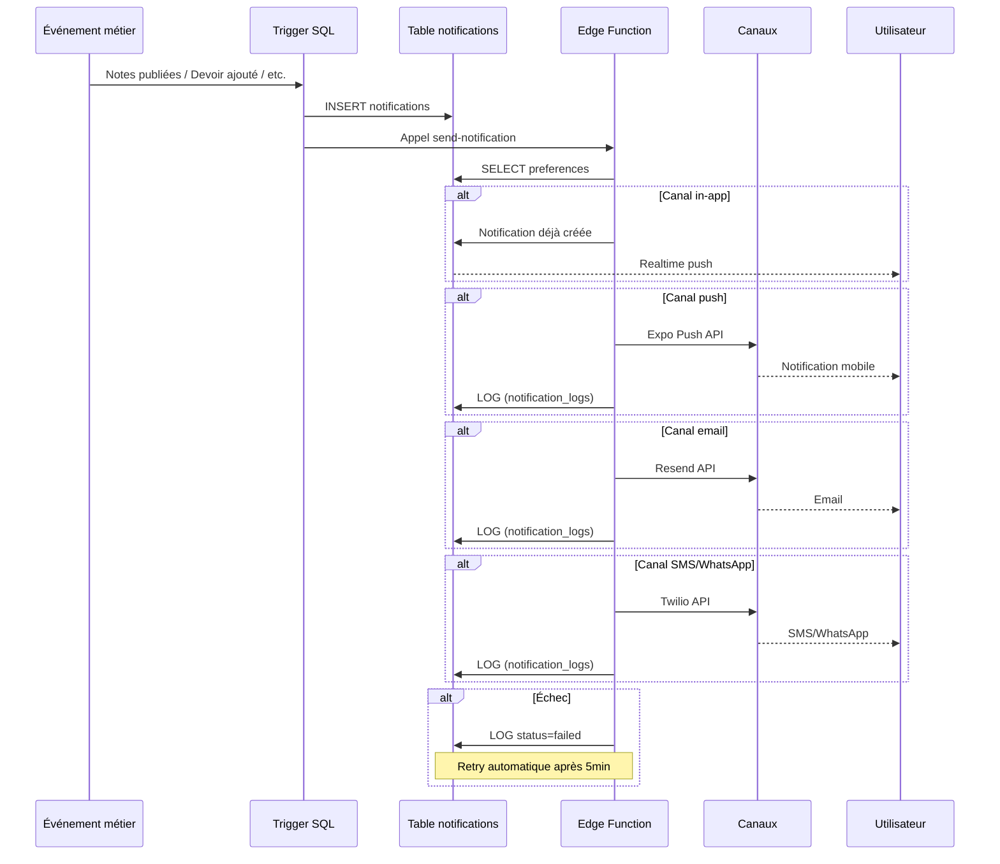

# Documentation du Système de Notifications NovaConnect

## Table des matières

1. [Architecture globale](#architecture-globale)
2. [Types de notifications](#types-de-notifications)
3. [Configuration](#configuration)
4. [Triggers automatiques](#triggers-automatiques)
5. [Edge Functions](#edge-functions)
6. [Système de retry](#système-de-retry)
7. [Préférences utilisateur](#préférences-utilisateur)
8. [Monitoring et debugging](#monitoring-et-debugging)

---

## Architecture globale

### Diagramme de flux



### Tables de la base de données

#### `notifications`
Table principale stockant toutes les notifications créées.

| Colonne | Type | Description |
|---------|------|-------------|
| `id` | UUID | Identifiant unique |
| `school_id` | UUID | École concernée |
| `user_id` | UUID | Destinataire de la notification |
| `type` | ENUM | Type de notification (voir [Types](#types-de-notifications)) |
| `title` | TEXT | Titre de la notification |
| `body` | TEXT | Corps de la notification |
| `data` | JSONB | Données additionnelles |
| `priority` | ENUM | Priorité : 'low', 'normal', 'urgent' |
| `channels` | TEXT[] | Canaux d'envoi : ['in_app', 'push', 'email', 'sms', 'whatsapp'] |
| `read_at` | TIMESTAMPTZ | Date de lecture |
| `created_at` | TIMESTAMPTZ | Date de création |

#### `notification_preferences`
Préférences utilisateur par type de notification.

| Colonne | Type | Description |
|---------|------|-------------|
| `id` | UUID | Identifiant unique |
| `user_id` | UUID | Utilisateur concerné |
| `notification_type` | ENUM | Type de notification |
| `enabled_channels` | TEXT[] | Canaux activés pour ce type |

#### `notification_logs`
Logs d'envoi pour chaque canal.

| Colonne | Type | Description |
|---------|------|-------------|
| `id` | UUID | Identifiant unique |
| `notification_id` | UUID | Notification concernée |
| `channel` | TEXT | Canal utilisé |
| `status` | TEXT | Statut : 'sent', 'failed' |
| `error_message` | TEXT | Message d'erreur si échec |
| `sent_at` | TIMESTAMPTZ | Date d'envoi |
| `retry_count` | INTEGER | Nombre de tentatives |
| `next_retry_at` | TIMESTAMPTZ | Date du prochain retry |
| `metadata` | JSONB | Métadonnées additionnelles |

---

## Types de notifications

### Liste complète

| Type | Description | Destinataires | Canaux par défaut |
|------|-------------|---------------|-------------------|
| `grade_posted` | Notes publiées | Élèves + Parents | in-app, push, email |
| `assignment_added` | Nouveau devoir ajouté | Élèves + Parents | in-app, push, email |
| `schedule_published` | EDT publié | Profs + Élèves + Parents | in-app, push |
| `schedule_updated` | EDT modifié | Profs + Élèves + Parents | in-app, push |
| `attendance_marked` | Absence/Retard marqué | Parents | in-app, push |
| `hours_validated` | Heures professeur validées | Professeur | in-app, push, email |
| `payroll_payment` | Paiement effectué | Professeur | in-app, push, email |
| `document_blocked` | Document bloqué | Parents | in-app, push, email, sms |
| `payment_overdue` | Paiement en retard | Élèves + Parents | in-app, push, email, sms, whatsapp |

### Ajouter un nouveau type

```sql
-- Ajouter un type à l'énumération
ALTER TYPE notification_type_enum ADD VALUE 'new_type';

-- Mettre à jour les préférences par défaut (voir section Configuration)
```

---

## Configuration

### Variables d'environnement

#### Email (Resend)
```env
RESEND_API_KEY=re_xxxxx
RESEND_FROM_EMAIL=notifications@novaconnect.app
```

#### SMS/WhatsApp (Twilio)
```env
TWILIO_ACCOUNT_SID=ACxxxxx
TWILIO_AUTH_TOKEN=xxxxx
TWILIO_PHONE_NUMBER=+1234567890
TWILIO_WHATSAPP_NUMBER=whatsapp:+1234567890
```

#### Expo Push
```env
EXPO_ACCESS_TOKEN=xxxxx
```

#### Supabase
```env
SUPABASE_URL=https://xxxxx.supabase.co
SUPABASE_SERVICE_ROLE_KEY=xxxxx
```

### Configuration des préférences par défaut

Les préférences par défaut sont définies dans [`apps/web/src/app/api/notifications/preferences/default/route.ts`](../apps/web/src/app/api/notifications/preferences/default/route.ts).

```typescript
const DEFAULT_CHANNELS = {
  grade_posted: ['in_app', 'push', 'email'],
  assignment_added: ['in_app', 'push', 'email'],
  // ... autres types
};
```

### Configuration du cron job pour retry

Le système de retry utilise une Edge Function appelée périodiquement. Configurez le cron job via :

**Option 1: pg_cron (Supabase)**
```sql
-- Exécuter toutes les 10 minutes
SELECT cron.schedule(
  'retry-failed-notifications',
  '*/10 * * * *',
  $$
  SELECT net.http_post(
    url := format('%s/functions/v1/retry-failed-notifications', current_setting('app.supabase_url')),
    headers := jsonb_build_object('Authorization', format('Bearer %s', current_setting('app.supabase_service_role_key'))),
    body := '{}'::jsonb
  );
  $$
);
```

**Option 2: Service externe (GitHub Actions, Vercel Cron)**
```yaml
# .github/workflows/retry-notifications.yml
name: Retry Failed Notifications
on:
  schedule:
    - cron: '*/10 * * * *'
jobs:
  retry:
    runs-on: ubuntu-latest
    steps:
      - name: Trigger retry function
        run: |
          curl -X POST "${{ secrets.SUPABASE_URL }}/functions/v1/retry-failed-notifications" \
            -H "Authorization: Bearer ${{ secrets.SUPABASE_SERVICE_ROLE_KEY }}"
```

---

## Triggers automatiques

### Liste des triggers

| Trigger | Table | Événement | Description |
|---------|-------|-----------|-------------|
| `notify_grades_published_trigger` | `grades` | AFTER UPDATE | Notification quand `status` passe à 'published' |
| `notify_lesson_assignment_added_trigger` | `lesson_logs` | AFTER INSERT OR UPDATE | Notification quand un devoir est ajouté |
| `notify_teacher_hours_validated_trigger` | `teacher_hours` | AFTER UPDATE | Notification quand les heures sont validées |
| `notify_teacher_payment_recorded_trigger` | `teacher_payments` | AFTER INSERT | Notification quand un paiement est enregistré |
| `trigger_notify_document_blocked` | `documents` | AFTER UPDATE | Notification quand un document est bloqué |

### Exemple de trigger

```sql
-- Trigger pour les notes publiées
CREATE TRIGGER notify_grades_published_trigger
    AFTER UPDATE ON grades
    FOR EACH ROW
    EXECUTE FUNCTION notify_grades_published();
```

---

## Edge Functions

### `send-notification`

**URL** : `/functions/v1/send-notification`

**Description** : Fonction générique multi-canal pour envoyer des notifications.

**Paramètres** :
```typescript
{
  notifications: Array<{
    userId: string;
    type: string;
    title: string;
    body: string;
    data?: Record<string, unknown>;
    priority?: string;
    channels?: string[];
  }>;
  schoolId: string;
}
```

**Réponse** :
```typescript
{
  success: boolean;
  count: number;
  notifications: Notification[];
}
```

**Logique** :
1. Crée les notifications dans la table `notifications`
2. Envoie via Realtime (in-app)
3. Appelle Expo pour les push notifications
4. Appelle `send-email-notification` pour les emails
5. Appelle `send-sms-notification` pour les SMS/WhatsApp
6. Log les résultats dans `notification_logs`

---

### `send-email-notification`

**URL** : `/functions/v1/send-email-notification`

**Description** : Envoi d'emails via Resend.

**Paramètres** :
```typescript
{
  to: string | string[];
  subject: string;
  html: string;
  text?: string;
  from?: string;
  replyTo?: string;
  notificationId?: string;
}
```

**Réponse** :
```typescript
{
  success: boolean;
  messageId?: string;
  error?: string;
}
```

**Fonctionnalités** :
- Template HTML NovaConnect personnalisable
- Validation des emails
- Gestion des erreurs avec retry automatique
- Logging dans `notification_logs`

---

### `send-sms-notification`

**URL** : `/functions/v1/send-sms-notification`

**Description** : Envoi de SMS et WhatsApp via Twilio.

**Paramètres** :
```typescript
{
  to: string;
  message: string;
  channel: 'sms' | 'whatsapp';
  notificationId?: string;
}
```

**Réponse** :
```typescript
{
  success: boolean;
  messageId?: string;
  to: string;
  channel: string;
  estimatedCost?: number;
}
```

**Fonctionnalités** :
- Normalisation des numéros (format E.164)
- Troncation automatique des SMS (>160 caractères)
- Gestion des erreurs spécifiques WhatsApp
- Estimation des coûts

---

### `retry-failed-notifications`

**URL** : `/functions/v1/retry-failed-notifications`

**Description** : Retry automatique des notifications échouées avec exponential backoff.

**Paramètres** : Aucun (appelé par cron job)

**Réponse** :
```typescript
{
  success: boolean;
  retried: number;
  succeeded: number;
  willRetry: number;
  permanentFailures: number;
}
```

**Stratégie de retry** :
- **1ère tentative** : immédiate
- **2ème tentative** : après 5 minutes
- **3ème tentative** : après 15 minutes
- **4ème tentative** : après 1 heure
- **Au-delà** : marqué comme échec permanent

---

## Système de retry

### Mécanisme

1. **Détection des échecs** : Les Edge Functions marquent les échecs avec `status: 'failed'` dans `notification_logs`
2. **Tentative de retry** : Le cron job appelle `retry-failed-notifications` toutes les 10 minutes
3. **Exponential backoff** : Délai croissant entre les tentatives
4. **Limite de tentatives** : Maximum 3 retries par notification

### Requêtes de monitoring

```sql
-- Voir les notifications échouées
SELECT * FROM notification_logs
WHERE status = 'failed'
AND retry_count < 3
ORDER BY sent_at DESC;

-- Voir les échecs permanents
SELECT * FROM notification_logs
WHERE retry_count >= 3
ORDER BY sent_at DESC;

-- Voir les statistiques de succès par canal
SELECT
  channel,
  COUNT(*) FILTER (WHERE status = 'sent') as sent,
  COUNT(*) FILTER (WHERE status = 'failed') as failed,
  ROUND(COUNT(*) FILTER (WHERE status = 'sent')::numeric / COUNT(*) * 100, 2) as success_rate
FROM notification_logs
GROUP BY channel;
```

---

## Préférences utilisateur

### Web

**URL** : `/settings/notifications`

**Fonctionnalités** :
- Tableau avec tous les types de notifications
- Switch pour activer/désactiver chaque canal
- Sauvegarde des modifications
- Réinitialisation aux valeurs par défaut

**API** :
- `GET /api/notifications/preferences?userId={id}` : Récupérer les préférences
- `POST /api/notifications/preferences` : Sauvegarder les préférences
- `POST /api/notifications/preferences/default?userId={id}` : Réinitialiser

### Mobile

**Route** : `app/settings/notification-preferences.tsx`

**Fonctionnalités** :
- Interface mobile avec ScrollView
- Groupement par catégorie (Scolaire, Financier, Administratif)
- Sauvegarde automatique (debounced)
- Icônes pour chaque canal

### Restrictions

- **Au moins un canal actif** : Impossible de désactiver tous les canaux pour un type de notification
- **Validation** : Les interfaces web et mobile appliquent cette règle

---

## Monitoring et debugging

### Métriques clés

1. **Taux de succès par canal** : Pourcentage de notifications envoyées avec succès
2. **Délai d'envoi** : Temps entre la création et l'envoi effectif
3. **Taux de retry** : Pourcentage de notifications nécessitant un retry
4. **Coûts** : Estimation des coûts SMS/WhatsApp

### Requêtes utiles

```sql
-- Notifications créées par jour
SELECT
  DATE(created_at) as date,
  COUNT(*) as count
FROM notifications
GROUP BY DATE(created_at)
ORDER BY date DESC
LIMIT 30;

-- Notifications non lues par utilisateur
SELECT
  u.id,
  u.first_name,
  u.last_name,
  COUNT(*) as unread_count
FROM notifications n
JOIN users u ON u.id = n.user_id
WHERE n.read_at IS NULL
GROUP BY u.id, u.first_name, u.last_name
ORDER BY unread_count DESC;

-- Logs d'erreur récents
SELECT
  nl.id,
  nl.channel,
  nl.error_message,
  nl.sent_at,
  n.title,
  n.type
FROM notification_logs nl
JOIN notifications n ON n.id = nl.notification_id
WHERE nl.status = 'failed'
ORDER BY nl.sent_at DESC
LIMIT 50;

-- Temps moyen d'envoi par canal
SELECT
  channel,
  AVG(EXTRACT(EPOCH FROM (sent_at - n.created_at))) as avg_seconds
FROM notification_logs nl
JOIN notifications n ON n.id = nl.notification_id
WHERE nl.status = 'sent'
GROUP BY channel;
```

### Résolution des problèmes courants

#### Emails non reçus

1. Vérifier les logs : `SELECT * FROM notification_logs WHERE channel = 'email' AND status = 'failed'`
2. Vérifier la configuration Resend (clé API valide)
3. Vérifier que l'email utilisateur est correct
4. Vérifier les dossiers spam/promotions

#### Push notifications non reçues

1. Vérifier que le push token est valide : `SELECT * FROM users WHERE metadata->>'push_token' IS NOT NULL`
2. Vérifier les permissions de notification sur l'appareil
3. Tester avec Expo Push Tool : https://expo.dev/notifications

#### SMS non reçus

1. Vérifier le format du numéro (E.164) : `SELECT * FROM users WHERE metadata->>'phone_number' NOT LIKE '+%'`
2. Vérifier le solde Twilio
3. Vérifier que le numéro n'est pas sur la liste noire

#### WhatsApp non reçus

1. Vérifier que le numéro est inscrit à WhatsApp
2. Vérifier que le template WhatsApp est approuvé (si utilisé)
3. Vérifier les logs Twilio pour les erreurs spécifiques

---

## Annexes

### Liens utiles

- [Documentation Resend](https://resend.com/docs)
- [Documentation Twilio](https://www.twilio.com/docs)
- [Documentation Expo](https://docs.expo.dev/)
- [Documentation Supabase](https://supabase.com/docs)

### Changelog

- **2025-01-16** : Création du système de notifications multi-canal
  - Triggers pour notes et devoirs
  - Edge Functions pour email, SMS, WhatsApp
  - Système de retry avec exponential backoff
  - Interfaces web et mobile de configuration
