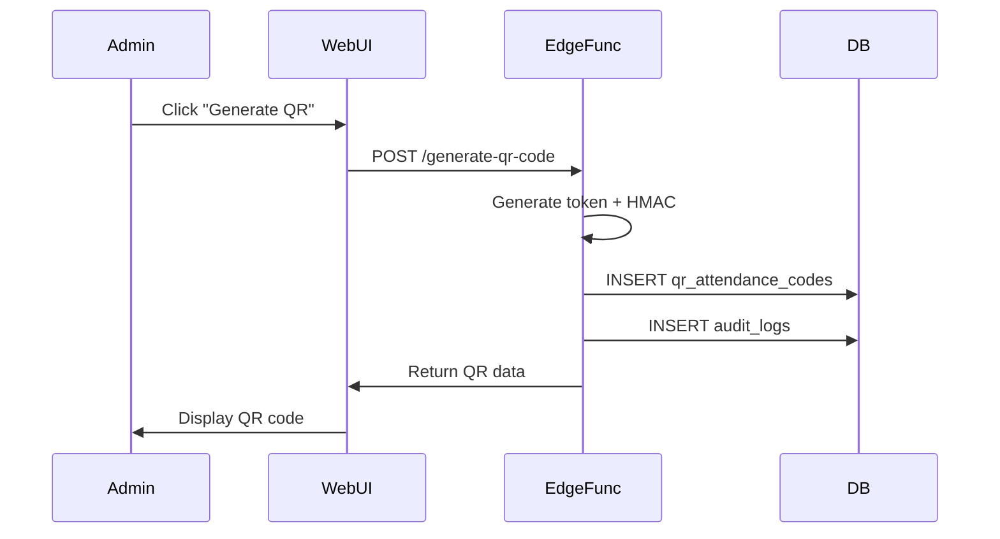
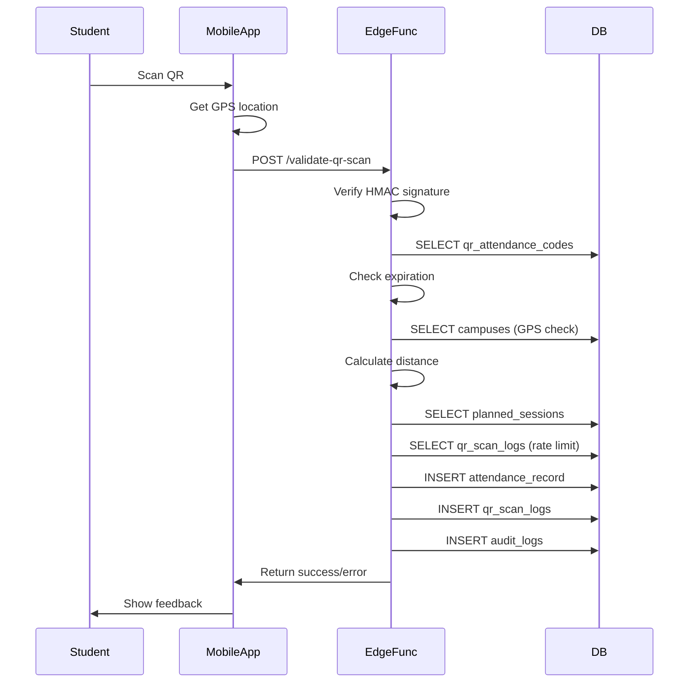

# QR Code Attendance System

Complete documentation for NovaConnect's secure QR code-based attendance tracking system.

## Table of Contents

1. [Overview](#overview)
2. [Architecture](#architecture)
3. [Security Model](#security-model)
4. [Database Schema](#database-schema)
5. [Edge Functions](#edge-functions)
6. [Configuration](#configuration)
7. [User Guides](#user-guides)
8. [API Reference](#api-reference)
9. [Troubleshooting](#troubleshooting)

---

## Overview

The QR Code Attendance System enables students to check into classes by scanning QR codes displayed by teachers. The system includes multiple security layers to prevent fraud:

- **HMAC-signed tokens** prevent QR code forgery
- **GPS validation** ensures physical presence on campus
- **Time-based expiration** limits QR code validity
- **Rate limiting** prevents multiple scans
- **Audit logging** tracks all scan attempts

### Key Features

- ✅ Dynamic QR code generation with automatic rotation
- ✅ Multi-layer security (signature + GPS + Wi-Fi)
- ✅ Real-time validation and feedback
- ✅ Comprehensive audit trail
- ✅ Configurable anti-fraud measures
- ✅ Mobile-friendly scanning interface

---

## Architecture

### System Components

```
┌─────────────────┐      ┌──────────────────┐      ┌─────────────────┐
│  Admin Web UI   │─────▶│  Supabase DB     │◀─────│  Mobile Student │
│  (QR Display)   │      │  + Edge Functions│      │  (QR Scanner)   │
└─────────────────┘      └──────────────────┘      └─────────────────┘
                                │
                                ▼
                        ┌──────────────────┐
                        │  Attendance      │
                        │  Records         │
                        └──────────────────┘
```

### Data Flow

1. **QR Generation**: Admin generates QR via web UI → Edge Function creates signed token → Stored in database
2. **QR Display**: QR code displayed in classroom (auto-rotates based on expiry)
3. **QR Scan**: Student scans QR → Mobile app extracts token + signature → Sends to Edge Function
4. **Validation**: Edge Function validates → Creates attendance record → Returns result

---

## Security Model

### 1. HMAC Signature

Each QR code contains a token signed with HMAC-SHA256:

```
token = "schoolId:codeType:classId:timestamp:randomBytes"
signature = HMAC-SHA256(token, QR_SIGNING_SECRET)
```

**Verification**: The Edge Function recalculates the HMAC and compares it with the provided signature.

**Environment Variable**: `QR_SIGNING_SECRET` (stored securely in Supabase)

### 2. GPS Validation

When enabled, the system validates the student's location:

```typescript
distance = calculateDistance(studentLat, studentLon, campusLat, campusLon);
if (distance > campus.radius_meters) {
  return { error: 'out_of_range' };
}
```

**Default radius**: 200 meters (configurable per campus)

### 3. Time-based Expiration

QR codes automatically expire after `qrValidityMinutes` (default: 10 minutes).

### 4. Rate Limiting

Students can scan at most `maxScansPerSession` times within a 15-minute window (default: 1 scan).

### 5. Duplicate Detection

System checks if an attendance record already exists for the same session and student.

---

## Database Schema

### `qr_attendance_codes`

Stores generated QR codes with signatures and expiration.

| Column | Type | Description |
|--------|------|-------------|
| `id` | UUID | Primary key |
| `school_id` | UUID | FK to schools |
| `code_type` | ENUM | `school_global`, `class_specific`, `student_card` |
| `class_id` | UUID | FK to classes (nullable) |
| `qr_token` | TEXT | Unique token (signed) |
| `signature` | TEXT | HMAC-SHA256 signature |
| `generated_at` | TIMESTAMPTZ | Generation timestamp |
| `expires_at` | TIMESTAMPTZ | Expiration timestamp |
| `is_active` | BOOLEAN | Active status |
| `rotation_interval_minutes` | INTEGER | Rotation interval |

### `qr_scan_logs`

Logs all scan attempts (success and failures).

| Column | Type | Description |
|--------|------|-------------|
| `id` | UUID | Primary key |
| `school_id` | UUID | FK to schools |
| `qr_code_id` | UUID | FK to qr_attendance_codes |
| `student_id` | UUID | FK to students |
| `scan_status` | ENUM | Status (success, expired_qr, etc.) |
| `scanned_at` | TIMESTAMPTZ | Scan timestamp |
| `latitude` | DECIMAL(9,6) | GPS latitude |
| `longitude` | DECIMAL(9,6) | GPS longitude |
| `device_info` | JSONB | Device metadata |

---

## Edge Functions

### 1. `generate-qr-code`

Generates a new QR code with HMAC signature.

**Endpoint**: `POST /functions/v1/generate-qr-code`

**Request**:
```json
{
  "schoolId": "uuid",
  "codeType": "class_specific",
  "classId": "uuid",
  "campusId": "uuid"
}
```

**Response**:
```json
{
  "qrCodeId": "uuid",
  "qrData": "novaconnect://attendance/scan?token=...&sig=...",
  "expiresAt": "2025-01-22T10:30:00Z",
  "rotationIntervalMinutes": 10
}
```

**Authorization**: Admin/Supervisor only

### 2. `validate-qr-scan`

Validates a QR code scan and creates attendance record.

**Endpoint**: `POST /functions/v1/validate-qr-scan`

**Request**:
```json
{
  "token": "schoolId:class_specific:uuid:timestamp:random",
  "signature": "hex-encoded-hmac",
  "latitude": 48.8566,
  "longitude": 2.3522,
  "wifiSsid": "School-WiFi",
  "deviceInfo": {
    "platform": "ios",
    "appVersion": "1.0.0"
  }
}
```

**Response (Success)**:
```json
{
  "success": true,
  "attendanceRecordId": "uuid",
  "message": "Présence enregistrée avec succès"
}
```

**Response (Error)**:
```json
{
  "success": false,
  "error": "out_of_range",
  "message": "Vous êtes trop loin de l'école (450m). Rayon autorisé: 200m"
}
```

**Authorization**: Student only

**Error Types**:
- `expired_qr`: QR code expired or deactivated
- `invalid_signature`: HMAC signature mismatch
- `wrong_class`: Student not enrolled in this class
- `wrong_time`: No class session at this time
- `out_of_range`: GPS location outside campus radius
- `rate_limited`: Too many scans recently
- `duplicate_scan`: Already scanned for this session

### 3. `cleanup-expired-qr-codes`

Cron job to deactivate and delete old QR codes.

**Schedule**: Run every hour via Supabase cron

**Actions**:
1. Deactivate expired QR codes
2. Delete QR codes expired for >30 days
3. Log all actions in `audit_logs`

---

## Configuration

### School Settings

QR attendance configuration is stored in `schools.settings.qrAttendance`:

```json
{
  "qrAttendance": {
    "enabled": true,
    "qrValidityMinutes": 10,
    "qrRotationMinutes": 10,
    "enableAntiFraud": true,
    "requireGpsValidation": true,
    "maxScansPerSession": 1
  }
}
```

### Parameters

| Parameter | Type | Default | Range | Description |
|-----------|------|---------|-------|-------------|
| `enabled` | boolean | `false` | - | Enable/disable QR attendance |
| `qrValidityMinutes` | integer | `10` | 5-60 | QR code validity duration |
| `qrRotationMinutes` | integer | `10` | 5-60 | Auto-rotation interval |
| `enableAntiFraud` | boolean | `true` | - | Enable anti-fraud checks |
| `requireGpsValidation` | boolean | `true` | - | Require GPS validation |
| `maxScansPerSession` | integer | `1` | 1-5 | Max scans per 15 min |

### Environment Variables

| Variable | Required | Description |
|----------|----------|-------------|
| `QR_SIGNING_SECRET` | ✅ Yes | Secret key for HMAC signatures (256-bit minimum) |
| `SUPABASE_URL` | ✅ Yes | Supabase project URL |
| `SUPABASE_SERVICE_ROLE_KEY` | ✅ Yes | Service role key for Edge Functions |

---

## User Guides

### For Administrators

#### Enabling QR Attendance

1. Go to **Admin Settings** → **School Settings** → **QR Attendance**
2. Toggle **Enable QR Attendance** to `ON`
3. Configure parameters:
   - **QR Validity**: 10 minutes (recommended)
   - **Rotation Interval**: 10 minutes (recommended)
   - **GPS Validation**: Enabled
   - **Max Scans**: 1 per session
4. Click **Save**

#### Generating QR Codes

1. Go to **Attendance** → **QR Display**
2. Select QR type:
   - **School Global**: Single QR for entire school
   - **Per Class**: Unique QR for each class
3. Click **Generate QR Code**
4. Display QR on projector/smartboard
5. QR auto-rotates every 10 minutes

#### Monitoring Scans

1. Go to **Attendance** → **QR Scan Logs**
2. View real-time scan attempts:
   - **Success** (green): Valid attendance
   - **Failed** (red): Fraud attempts or errors
3. Filter by date, class, student, status
4. Export logs for analysis

### For Teachers

#### Displaying QR in Class

1. Open **Attendance** → **QR Display**
2. Select your class from dropdown
3. Click **Generate QR Code**
4. Project QR on classroom screen
5. Students scan with mobile app
6. Monitor live scan count

#### Viewing Attendance

1. Go to **Attendance** → **Class Attendance**
2. Filter by session
3. QR scans appear with **"QR"** badge
4. Manual attendance marked by teacher

### For Students

#### Scanning QR Code

1. Open NovaConnect mobile app
2. Tap **Scan QR** (in attendance tab)
3. Grant camera and location permissions
4. Point camera at QR code
5. Wait for validation:
   - ✅ **Green**: Attendance recorded
   - ❌ **Red**: Error message
6. View scan history in app

#### Error Messages

| Error | Cause | Solution |
|-------|-------|----------|
| "QR expiré" | QR code expired | Wait for teacher to refresh QR |
| "Hors zone" | Outside campus radius | Move closer to school |
| "Mauvaise classe" | Wrong class QR | Scan correct class QR |
| "Déjà scanné" | Already scanned | You're already marked present |
| "Trop de scans" | Rate limit exceeded | Wait 15 minutes |

---

## API Reference

### React Hooks

#### `useGenerateQrCode()`

Generate a new QR code.

```typescript
const generateMutation = useGenerateQrCode();

const handleGenerate = async () => {
  try {
    const result = await generateMutation.mutateAsync({
      schoolId: 'uuid',
      codeType: 'class_specific',
      classId: 'uuid',
    });
    console.log('QR generated:', result.qrData);
  } catch (error) {
    console.error('Error:', error);
  }
};
```

#### `useValidateQrScan()`

Validate a QR scan.

```typescript
const validateMutation = useValidateQrScan();

const handleScan = async (token: string, signature: string) => {
  const position = await getCurrentPosition();

  const result = await validateMutation.mutateAsync({
    token,
    signature,
    latitude: position.coords.latitude,
    longitude: position.coords.longitude,
    deviceInfo: {
      platform: Platform.OS,
      appVersion: '1.0.0',
    },
  });

  if (result.success) {
    Alert.alert('Succès', 'Présence enregistrée ✓');
  } else {
    Alert.alert('Erreur', result.message);
  }
};
```

#### `useSchoolScanLogs(schoolId, filters)`

Fetch scan logs for admin view.

```typescript
const { data: logs, isLoading } = useSchoolScanLogs(schoolId, {
  startDate: '2025-01-01',
  endDate: '2025-01-31',
  status: 'success',
});
```

### Utility Functions

#### `calculateDistance(lat1, lon1, lat2, lon2)`

Calculate distance between two GPS coordinates (Haversine formula).

```typescript
const distance = calculateDistance(
  48.8566, 2.3522, // Paris
  48.8606, 2.3376  // Louvre
);
console.log(`${Math.round(distance)}m`); // "4175m"
```

#### `isWithinRadius(userLat, userLon, campusLat, campusLon, radius)`

Check if user is within campus radius.

```typescript
const isValid = isWithinRadius(
  studentLat, studentLon,
  campusLat, campusLon,
  200 // meters
);
```

---

## Troubleshooting

### Common Issues

#### QR Code Not Scanning

**Symptoms**: Mobile app can't detect QR code

**Solutions**:
1. Ensure QR is displayed in high resolution
2. Check room lighting (avoid glare)
3. Hold mobile device steady
4. Ensure QR hasn't expired (check timer)
5. Refresh QR code if needed

#### "Hors Zone" (Out of Range) Error

**Symptoms**: Student is on campus but gets "out_of_range" error

**Solutions**:
1. Check GPS accuracy (should be < 50m)
2. Verify campus GPS coordinates in settings
3. Increase campus radius in campus settings
4. Check if student is using VPN (affects GPS)
5. Try rescanning after moving to open area

#### "Signature Invalide" Error

**Symptoms**: QR scan fails with signature validation error

**Solutions**:
1. Regenerate QR code (may be corrupted)
2. Check `QR_SIGNING_SECRET` environment variable
3. Ensure Edge Functions are deployed
4. Verify Supabase URL is correct

#### High Rate of Failed Scans

**Symptoms**: Many students getting errors during class

**Solutions**:
1. Check school Wi-Fi connectivity
2. Verify GPS validation isn't too strict
3. Increase `qrValidityMinutes` (e.g., to 15 min)
4. Disable GPS validation if indoors (GPS poor)
5. Check Edge Function logs for errors

### Performance Optimization

#### Slow QR Validation

**Causes**:
- High database query latency
- Too many active QR codes
- Insufficient Edge Function compute

**Solutions**:
1. Add database indexes on `qr_attendance_codes`:
   ```sql
   CREATE INDEX idx_qr_codes_qr_token ON qr_attendance_codes(qr_token);
   ```
2. Cleanup expired QR codes regularly
3. Enable Edge Function caching

#### High Memory Usage

**Solutions**:
1. Limit QR code history (auto-delete after 30 days)
2. Archive old scan logs to separate table
3. Use pagination for scan logs UI

---

## Sequence Diagrams

### QR Generation Flow



### QR Scan Validation Flow



---

## Best Practices

### Security

1. **Never expose `QR_SIGNING_SECRET`** - Store only in Supabase environment variables
2. **Use short QR validity** - 10 minutes max recommended
3. **Enable GPS validation** - Prevents remote scanning
4. **Monitor scan logs** - Watch for suspicious patterns
5. **Limit rate** - 1 scan per session default

### Performance

1. **Auto-rotate QR codes** - Reduces load on active codes
2. **Index database** - Ensure `qr_token` and `expires_at` indexed
3. **Cleanup regularly** - Run cron job hourly
4. **Cache QR display** - Don't regenerate on every page load

### User Experience

1. **Show countdown timer** - Students know when QR expires
2. **Clear error messages** - Actionable feedback in French
3. **Haptic feedback** - Vibrate on successful scan
4. **Real-time updates** - Show live scan count to teacher
5. **Offline support** - Cache pending scans if network down

---

## Future Enhancements

- [ ] Beacon integration (Bluetooth LE)
- [ ] NFC card support
- [ ] Multi-campus QR codes
- [ ] QR code analytics dashboard
- [ ] Student QR cards (long-lived)
- [ ] Facial recognition backup
- [ ] SMS notification on scan
- [ ] Parent notification system

---

## Support

For issues or questions:
- **Documentation**: [docs.novaconnect.fr](https://docs.novaconnect.fr)
- **GitHub Issues**: [github.com/novaconnect/qr-attendance](https://github.com/novaconnect/qr-attendance/issues)
- **Email**: support@novaconnect.fr

---

**Version**: 1.0.0
**Last Updated**: 2025-01-22
**Authors**: NovaConnect Team
