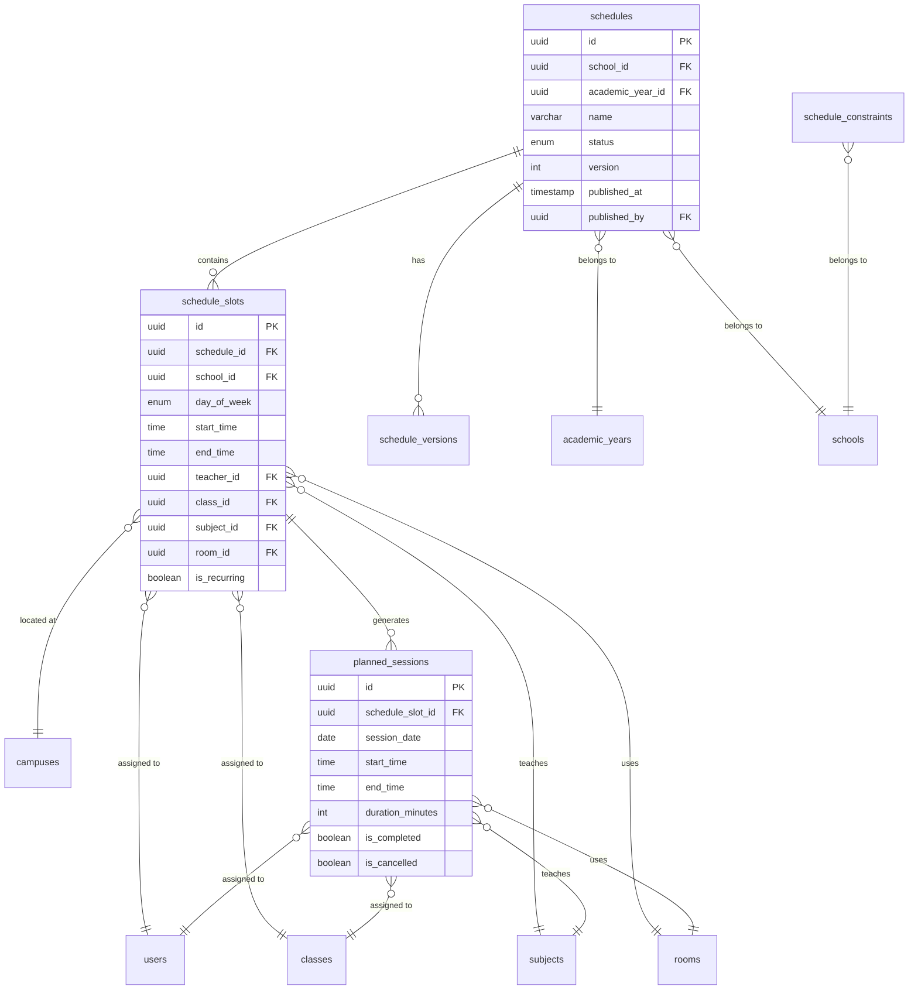
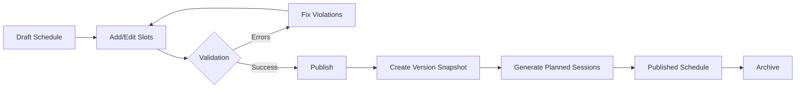
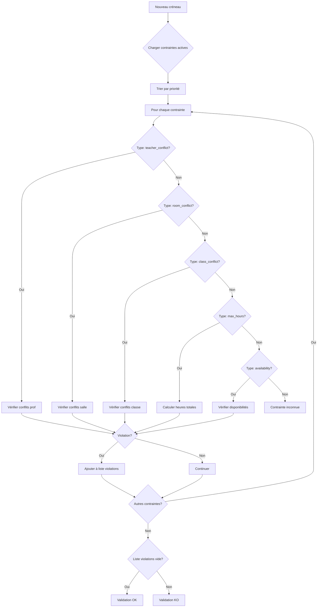
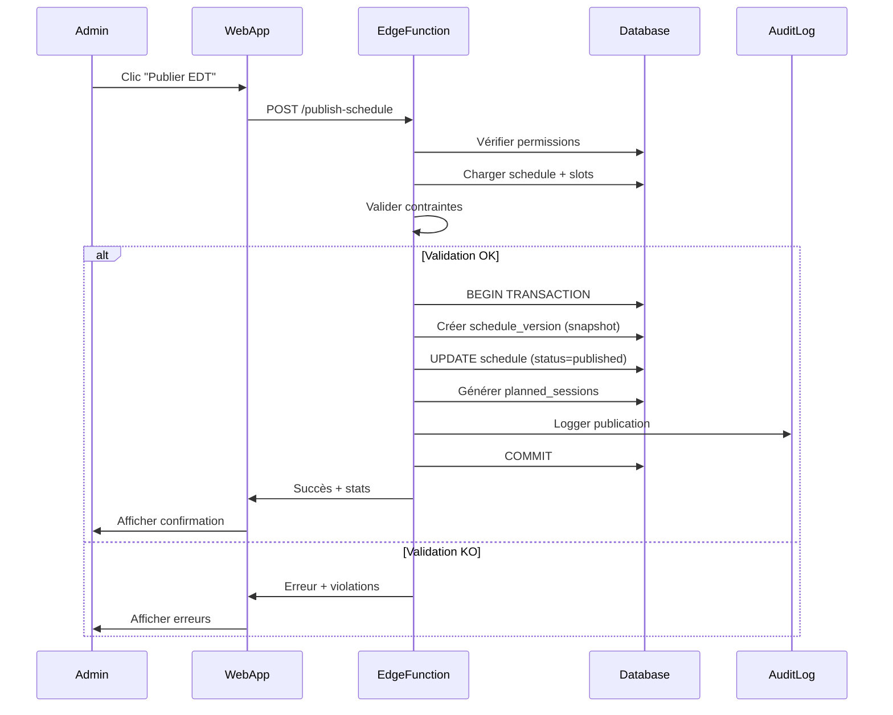

# Schedule System (EDT - Emploi du Temps)

## Table of Contents
1. [Overview](#overview)
2. [Architecture](#architecture)
3. [Database Schema](#database-schema)
4. [Versioning Model](#versioning-model)
5. [Constraints](#constraints)
6. [Publication Process](#publication-process)
7. [API Reference](#api-reference)
8. [React Hooks](#react-hooks)
9. [Edge Functions](#edge-functions)
10. [Integration with Other Modules](#integration-with-other-modules)
11. [Examples](#examples)

---

## Overview

The Schedule System (EDT - Emploi du Temps) is a comprehensive timetable management system that allows schools to create, manage, and publish schedules with the following features:

- **Flexible Scheduling**: Create time slots with teachers, subjects, classes, and rooms
- **Validation**: Automatic constraint checking for conflicts (teacher, room, class)
- **Version Control**: Track all changes with snapshots and version history
- **Publication**: Atomic publication with automatic session generation
- **Integration**: Seamless integration with notebook (cahier de texte) and payroll modules

---

## Architecture

### Database Schema



### Application Layers

```
┌─────────────────────────────────────────────────────────────┐
│                        UI Layer                             │
│              (Schedule Management Interface)                │
└────────────────────────┬────────────────────────────────────┘
                         │
┌────────────────────────▼────────────────────────────────────┐
│                    React Query Hooks                        │
│               (packages/data/src/hooks)                     │
│  - useSchedules()                                           │
│  - useScheduleSlots()                                       │
│  - usePublishSchedule()                                     │
└────────────────────────┬────────────────────────────────────┘
                         │
┌────────────────────────▼────────────────────────────────────┐
│                    Data Queries                             │
│               (packages/data/src/queries)                   │
│  - scheduleQueries                                          │
│  - scheduleSlotQueries                                      │
│  - plannedSessionQueries                                    │
└────────────────────────┬────────────────────────────────────┘
                         │
┌────────────────────────▼────────────────────────────────────┐
│              Validation & Business Logic                    │
│               (packages/core/src/utils)                     │
│  - validateScheduleSlot()                                   │
│  - checkTeacherConflict()                                   │
│  - checkRoomConflict()                                      │
│  - checkMaxHoursPerDay()                                    │
└────────────────────────┬────────────────────────────────────┘
                         │
┌────────────────────────▼────────────────────────────────────┐
│              Zod Validation Schemas                         │
│               (packages/core/src/schemas)                   │
│  - scheduleSchema                                           │
│  - createScheduleSlotSchema                                 │
│  - constraintTypeSchema                                     │
└────────────────────────┬────────────────────────────────────┘
                         │
┌────────────────────────▼────────────────────────────────────┐
│              Supabase Database & Edge Functions             │
│  - Tables: schedules, schedule_slots, planned_sessions      │
│  - Edge Function: publish-schedule                          │
└─────────────────────────────────────────────────────────────┘
```

---

## Database Schema

### Tables

#### 1. `schedules`
Main table for storing timetable schedules.

| Column | Type | Description |
|--------|------|-------------|
| `id` | UUID | Primary key |
| `school_id` | UUID | Foreign key to schools |
| `academic_year_id` | UUID | Foreign key to academic_years |
| `name` | VARCHAR(100) | Display name (e.g., "EDT Trimestre 1 2024-2025") |
| `description` | TEXT | Optional description |
| `status` | schedule_status_enum | `draft`, `published`, or `archived` |
| `version` | INTEGER | Version number (increments on publication) |
| `published_at` | TIMESTAMP | Publication timestamp |
| `published_by` | UUID | User who published |
| `metadata` | JSONB | Additional configuration |
| `created_at` | TIMESTAMP | Creation timestamp |
| `updated_at` | TIMESTAMP | Last update timestamp |

**Constraints:**
- Unique: `(school_id, academic_year_id, version)`
- Indexes: `school_id`, `academic_year_id`, `status`, `published_at`

#### 2. `schedule_slots`
Stores individual time slots within a schedule.

| Column | Type | Description |
|--------|------|-------------|
| `id` | UUID | Primary key |
| `schedule_id` | UUID | Foreign key to schedules (CASCADE DELETE) |
| `school_id` | UUID | Foreign key to schools |
| `day_of_week` | day_of_week_enum | Day of the week |
| `start_time` | TIME | Start time (HH:MM) |
| `end_time` | TIME | End time (HH:MM) |
| `teacher_id` | UUID | Foreign key to users (teacher) |
| `class_id` | UUID | Foreign key to classes |
| `subject_id` | UUID | Foreign key to subjects |
| `room_id` | UUID | Foreign key to rooms (optional) |
| `campus_id` | UUID | Foreign key to campuses (optional) |
| `is_recurring` | BOOLEAN | Whether slot repeats weekly |
| `recurrence_end_date` | DATE | End date for recurrence |
| `notes` | TEXT | Additional notes |
| `metadata` | JSONB | Additional data |
| `created_at` | TIMESTAMP | Creation timestamp |
| `updated_at` | TIMESTAMP | Last update timestamp |

**Constraints:**
- Check: `end_time > start_time`
- Indexes: `schedule_id`, `teacher_id`, `class_id`, `room_id`, `day_of_week`, `(start_time, end_time)`

#### 3. `schedule_versions`
Stores snapshots of schedule versions for historical tracking.

| Column | Type | Description |
|--------|------|-------------|
| `id` | UUID | Primary key |
| `schedule_id` | UUID | Foreign key to schedules |
| `school_id` | UUID | Foreign key to schools |
| `version` | INTEGER | Version number |
| `snapshot_data` | JSONB | Complete JSON snapshot of all slots |
| `change_summary` | TEXT | Description of changes |
| `created_by` | UUID | User who created this version |
| `created_at` | TIMESTAMP | Creation timestamp |

**Constraints:**
- Unique: `(schedule_id, version)`

#### 4. `schedule_constraints`
Stores validation constraints for schedule management.

| Column | Type | Description |
|--------|------|-------------|
| `id` | UUID | Primary key |
| `school_id` | UUID | Foreign key to schools |
| `constraint_type` | constraint_type_enum | Type of constraint |
| `constraint_config` | JSONB | Configuration specific to type |
| `is_active` | BOOLEAN | Whether constraint is active |
| `priority` | INTEGER | Validation order (lower = first) |
| `error_message` | TEXT | Custom error message |
| `created_at` | TIMESTAMP | Creation timestamp |
| `updated_at` | TIMESTAMP | Last update timestamp |

**Constraint Types:**
- `teacher_conflict`: Prevent double-booking teachers
- `room_conflict`: Prevent double-booking rooms
- `class_conflict`: Prevent double-booking classes
- `max_hours_per_day`: Limit daily hours per teacher
- `max_hours_per_week`: Limit weekly hours per teacher
- `teacher_availability`: Check teacher availability

#### 5. `planned_sessions`
Stores actual session instances generated from published schedules.

| Column | Type | Description |
|--------|------|-------------|
| `id` | UUID | Primary key |
| `school_id` | UUID | Foreign key to schools |
| `schedule_slot_id` | UUID | Foreign key to schedule_slots |
| `teacher_id` | UUID | Foreign key to users (teacher) |
| `class_id` | UUID | Foreign key to classes |
| `subject_id` | UUID | Foreign key to subjects |
| `room_id` | UUID | Foreign key to rooms |
| `session_date` | DATE | Actual date of the session |
| `start_time` | TIME | Start time |
| `end_time` | TIME | End time |
| `duration_minutes` | INTEGER | Duration in minutes |
| `is_completed` | BOOLEAN | Marked after notebook validation |
| `is_cancelled` | BOOLEAN | True if session was cancelled |
| `cancellation_reason` | TEXT | Reason for cancellation |
| `metadata` | JSONB | Additional data |
| `created_at` | TIMESTAMP | Creation timestamp |
| `updated_at` | TIMESTAMP | Last update timestamp |

**Constraints:**
- Check: `end_time > start_time`, `duration_minutes > 0`
- Check: NOT (`is_completed = true AND is_cancelled = true`)

---

## Versioning Model

The schedule system uses a versioning model to track changes and maintain history:

### Draft → Published Workflow



### Version Snapshots

When a schedule is published:
1. A new version is created in `schedule_versions`
2. All slots are saved as JSON in `snapshot_data`
3. The schedule status changes to `published`
4. `version` is incremented
5. All planned sessions are generated

### Version History

You can access the version history to:
- View previous versions
- Compare changes between versions
- Restore a previous version (by duplicating)
- Track who made changes and when

---

## Constraints

### Types of Constraints

#### 1. Teacher Conflict
Prevents a teacher from being in two places at once.

```typescript
{
  type: "teacher_conflict",
  config: {
    enabled: true
  }
}
```

#### 2. Room Conflict
Prevents double-booking of rooms.

```typescript
{
  type: "room_conflict",
  config: {
    enabled: true,
    allowDoubleBooking: false
  }
}
```

#### 3. Class Conflict
Prevents a class from having two simultaneous lessons.

```typescript
{
  type: "class_conflict",
  config: {
    enabled: true
  }
}
```

#### 4. Max Hours Per Day
Limits the number of hours a teacher can work per day.

```typescript
{
  type: "max_hours_per_day",
  config: {
    maxHours: 6,
    breakTime: 60 // minutes of break to exclude
  },
  priority: 1,
  errorMessage: "Teachers cannot work more than 6 hours per day"
}
```

#### 5. Max Hours Per Week
Limits weekly teaching hours.

```typescript
{
  type: "max_hours_per_week",
  config: {
    maxHours: 30
  },
  priority: 2
}
```

#### 6. Teacher Availability
Ensures teachers are available during scheduled slots.

```typescript
{
  type: "teacher_availability",
  config: {
    requireAvailability: true,
    allowOverride: false
  }
}
```

### Validation Flow



---

## Publication Process

### Sequence Diagram



### Steps

1. **Authentication**: Verify user is authenticated and has permission (school_admin or supervisor)
2. **Validation**: Check all constraints
3. **Transaction**: Execute publication atomically
   - Create version snapshot
   - Update schedule status
   - Generate planned sessions
   - Log action
4. **Response**: Return success with statistics or error with violations

### Session Generation

For each `schedule_slot`:
- **Recurring**: Generate sessions for all weeks between academic year start and `recurrence_end_date`
- **Non-recurring**: Generate single session on the next occurrence of the `day_of_week`

Example:
- Slot: Monday 08:00-09:30, recurring
- Academic year: Sept 1, 2024 - June 30, 2025
- Result: ~35 planned sessions (one per week)

---

## API Reference

### Queries

#### Schedule Queries

```typescript
import { scheduleQueries } from '@novaconnect/data';

// Get all schedules
const { data } = await scheduleQueries.getAll(schoolId, academicYearId, status).queryFn();

// Get schedule with slots
const { data } = await scheduleQueries.getWithSlots(id).queryFn();

// Get current published schedule
const { data } = await scheduleQueries.getCurrent(schoolId, academicYearId).queryFn();
```

#### Schedule Slot Queries

```typescript
import { scheduleSlotQueries } from '@novaconnect/data';

// Get all slots for a schedule
const { data } = await scheduleSlotQueries.getAll(scheduleId).queryFn();

// Get slots by teacher
const { data } = await scheduleSlotQueries.getByTeacher(teacherId, scheduleId).queryFn();

// Get slots by class
const { data } = await scheduleSlotQueries.getByClass(classId, scheduleId).queryFn();

// Get slots by day
const { data } = await scheduleSlotQueries.getByDay(scheduleId, 'monday').queryFn();
```

#### Planned Session Queries

```typescript
import { plannedSessionQueries } from '@novaconnect/data';

// Get sessions with filters
const { data } = await plannedSessionQueries.getAll(schoolId, {
  startDate: '2024-09-01',
  endDate: '2024-09-30',
  teacherId,
  isCompleted: false
}).queryFn();

// Get upcoming sessions
const { data } = await plannedSessionQueries.getUpcoming(teacherId, 'teacher', 10).queryFn();
```

---

## React Hooks

### Reading Schedules

```typescript
import { useSchedules, useScheduleWithSlots } from '@novaconnect/data';

function ScheduleList() {
  const { data: schedules, isLoading } = useSchedules(schoolId, academicYearId);

  if (isLoading) return <div>Loading...</div>;
  return <div>{/* render schedules */}</div>;
}

function ScheduleDetail({ scheduleId }) {
  const { data: schedule } = useScheduleWithSlots(scheduleId);

  return <div>{/* render schedule with slots */}</div>;
}
```

### Creating Slots

```typescript
import { useCreateScheduleSlot } from '@novaconnect/data';

function CreateSlotForm() {
  const createSlot = useCreateScheduleSlot();

  const handleSubmit = async (slotData) => {
    await createSlot.mutateAsync(slotData);
  };

  return <form onSubmit={handleSubmit}>{/* form fields */}</form>;
}
```

### Publishing Schedule

```typescript
import { usePublishSchedule } from '@novaconnect/data';

function PublishButton({ scheduleId }) {
  const publishSchedule = usePublishSchedule();

  const handlePublish = async () => {
    const result = await publishSchedule.mutateAsync({
      scheduleId,
      notifyUsers: true
    });

    if (result.success) {
      alert(`Schedule published! ${result.sessionsCreated} sessions created.`);
    } else {
      alert(`Validation failed: ${result.violations.length} violations`);
    }
  };

  return <button onClick={handlePublish}>Publish Schedule</button>;
}
```

---

## Edge Functions

### publish-schedule

**Endpoint**: `POST /functions/v1/publish-schedule`

**Authentication**: Bearer token required

**Request**:
```typescript
{
  scheduleId: string;
  notifyUsers?: boolean; // default: false
}
```

**Response (Success)**:
```typescript
{
  success: true;
  schedule: Schedule;
  sessionsCreated: number;
  violations?: ConstraintViolation[];
}
```

**Response (Error)**:
```typescript
{
  success: false;
  error: string;
  violations?: ConstraintViolation[];
}
```

---

## Integration with Other Modules

### Notebook (Cahier de Texte)

When a `planned_session` is completed:
1. Teacher marks session as completed via notebook
2. System creates/update notebook entry
3. Links `planned_session.id` to `notebook_entry.session_id`

### Payroll

When calculating payroll:
1. Query all `planned_sessions` for a teacher in a period
2. Filter where `is_completed = true` and `is_cancelled = false`
3. Count sessions and calculate salary based on `duration_minutes`

### Attendance

For each `planned_session`:
- Students can be marked present/absent
- Attendance records link to `planned_session.id`

### Presence

Similar to attendance, teachers can mark their presence for each `planned_session`.

---

## Examples

### Example 1: Create a Weekly Schedule

```typescript
import { useCreateSchedule, useCreateScheduleSlot } from '@novaconnect/data';

function CreateWeeklySchedule() {
  const createSchedule = useCreateSchedule();
  const createSlot = useCreateScheduleSlot();

  const handleCreate = async () => {
    // 1. Create schedule
    const schedule = await createSchedule.mutateAsync({
      schoolId: 'school-uuid',
      academicYearId: 'ay-uuid',
      name: 'EDT Trimestre 1 2024-2025',
      description: 'Weekly schedule for Q1',
      status: 'draft'
    });

    // 2. Add slots
    const slots = [
      {
        scheduleId: schedule.id,
        schoolId: schedule.schoolId,
        dayOfWeek: 'monday',
        startTime: '08:00',
        endTime: '09:30',
        teacherId: 'teacher-uuid',
        classId: 'class-uuid',
        subjectId: 'subject-uuid',
        roomId: 'room-uuid',
        isRecurring: true
      },
      // ... more slots
    ];

    for (const slot of slots) {
      await createSlot.mutateAsync(slot);
    }
  };

  return <button onClick={handleCreate}>Create Schedule</button>;
}
```

### Example 2: Validate Before Publishing

```typescript
import { useScheduleWithSlots, useScheduleConstraints, usePublishSchedule } from '@novaconnect/data';
import { validateSchedule } from '@novaconnect/core';

function ScheduleValidator({ scheduleId }) {
  const { data: schedule } = useScheduleWithSlots(scheduleId);
  const { data: constraints } = useScheduleConstraints(schedule.schoolId, true);
  const publishSchedule = usePublishSchedule();

  const handlePublish = async () => {
    // Client-side validation
    const result = validateSchedule(
      schedule.id,
      schedule.slots,
      constraints
    );

    if (!result.isValid) {
      alert(`Validation failed:\n${result.violations.map(v => v.message).join('\n')}`);
      return;
    }

    // Server-side validation + publication
    const publishResult = await publishSchedule.mutateAsync({
      scheduleId: schedule.id,
      notifyUsers: true
    });

    if (publishResult.success) {
      alert('Published successfully!');
    }
  };

  return <button onClick={handlePublish}>Validate & Publish</button>;
}
```

### Example 3: View Teacher's Schedule

```typescript
import { useScheduleSlotsByTeacher, usePlannedSessionsByTeacher } from '@novaconnect/data';

function TeacherSchedule({ teacherId }) {
  const { data: slots } = useScheduleSlotsByTeacher(teacherId, scheduleId);
  const { data: sessions } = usePlannedSessionsByTeacher(
    teacherId,
    '2024-09-01',
    '2024-09-30'
  );

  // Group by day
  const grouped = groupSlotsByDay(slots || []);

  return (
    <div>
      <h2>Weekly Schedule</h2>
      {Object.entries(grouped).map(([day, daySlots]) => (
        <div key={day}>
          <h3>{day}</h3>
          {daySlots.map(slot => (
            <div key={slot.id}>
              {slot.startTime} - {slot.endTime}: {slot.subjectId}
            </div>
          ))}
        </div>
      ))}
    </div>
  );
}
```

### Example 4: Configure Constraints

```typescript
import { useCreateScheduleConstraint } from '@novaconnect/data';

function ConfigureConstraints({ schoolId }) {
  const createConstraint = useCreateScheduleConstraint();

  const handleSetup = async () => {
    // Max 6 hours per day
    await createConstraint.mutateAsync({
      schoolId,
      constraintType: 'max_hours_per_day',
      constraint_config: { maxHours: 6, breakTime: 60 },
      isActive: true,
      priority: 1,
      errorMessage: 'Teachers cannot work more than 6 hours per day'
    });

    // Max 30 hours per week
    await createConstraint.mutateAsync({
      schoolId,
      constraintType: 'max_hours_per_week',
      constraint_config: { maxHours: 30 },
      isActive: true,
      priority: 2,
      errorMessage: 'Weekly limit exceeded'
    });

    // Enable teacher conflict detection
    await createConstraint.mutateAsync({
      schoolId,
      constraintType: 'teacher_conflict',
      constraint_config: { enabled: true },
      isActive: true,
      priority: 3
    });
  };

  return <button onClick={handleSetup}>Setup Constraints</button>;
}
```

---

## Best Practices

1. **Always validate client-side** before publishing to provide immediate feedback
2. **Use transactions** when making bulk updates to slots
3. **Handle conflicts gracefully** with clear error messages
4. **Implement caching** using React Query for performance
5. **Log all critical actions** for audit trail
6. **Test constraints** thoroughly before activating
7. **Use version history** to track changes and enable rollbacks

---

## Performance Considerations

1. **Indexes**: All foreign keys and filter columns are indexed
2. **Batch Operations**: Use `createBulkScheduleSlots` for multiple slots
3. **Pagination**: Implement pagination for large schedules
4. **Caching**: React Query automatically caches results
5. **Validation**: Validate client-side to reduce server load
6. **Session Generation**: Uses batch INSERT for efficiency

---

## Future Enhancements

- [ ] Import/export schedules (ICS format)
- [ ] Visual drag-and-drop schedule builder
- [ ] Automatic conflict resolution suggestions
- [ ] Substitute teacher management
- [ ] Holiday management
- [ ] Recurrence exceptions
- [ ] Multi-campus support
- [ ] Real-time collaboration
- [ ] Mobile notifications for schedule changes
