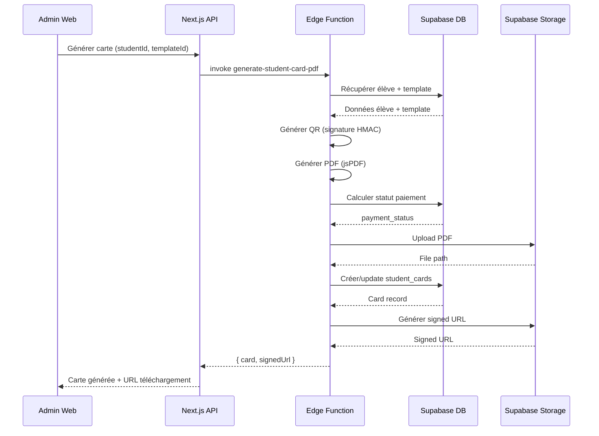

# Système de Cartes Scolaires - NovaConnect

## Vue d'ensemble

Le système de cartes scolaires de NovaConnect permet aux établissements de générer, gérer et distribuer des cartes d'identification sécurisées aux élèves. Les cartes incluent un QR code signé pour l'identification et peuvent être utilisées pour la présence (mode premium).

### Fonctionnalités principales

- **Génération de cartes PDF** : Génération automatique avec photo, informations élève, et QR code
- **Templates personnalisables** : Configuration du layout, couleurs, polices par école
- **QR code sécurisé** : Signature HMAC pour validation et prévention de fraude
- **Intégration paiements** : Blocage conditionnel selon statut de paiement
- **Validation en temps réel** : Scan QR pour identification et présence
- **Gestion multi-tenant** : Isolation complète par école
- **Audit complet** : Traçabilité de toutes les actions

## Architecture

### Composants

#### 1. Base de données

**Tables principales :**

- `card_templates` : Modèles de cartes personnalisables
- `student_cards` : Cartes générées avec métadonnées

**Relations :**

```
schools (1) ←→ (N) card_templates
schools (1) ←→ (N) student_cards
students (1) ←→ (N) student_cards
card_templates (1) ←→ (N) student_cards
users (1) ←→ (N) student_cards (generated_by, revoked_by, override_by)
```

#### 2. Edge Functions

- `generate-student-card-pdf` : Génération PDF avec QR code signé
- `validate-card-qr` : Validation QR et identification
- `revoke-student-card` : Révocation de carte

#### 3. Interfaces

- **Web Admin** (`/admin/student-cards`) :
  - Gestion des cartes (liste, filtres, actions)
  - Gestion des templates
  - Détails carte

- **Mobile** (`student-card.tsx`) :
  - Consultation carte numérique
  - Affichage QR code
  - Téléchargement PDF

- **Mobile Scanner** (`student-card-scanner.tsx`) :
  - Scan QR pour identification
  - Validation en temps réel
  - Historique des scans

## Flux de génération de carte



## Configuration des templates

### Structure du layout_config

```json
{
  "photoPosition": { "x": 10, "y": 10, "width": 30, "height": 40 },
  "qrPosition": { "x": 130, "y": 10, "size": 35 },
  "textColor": "#000000",
  "backgroundColor": "#FFFFFF",
  "borderColor": "#3b82f6",
  "fontSize": 10,
  "fontFamily": "Helvetica",
  "namePosition": { "x": 50, "y": 20 },
  "matriculePosition": { "x": 50, "y": 30 },
  "classPosition": { "x": 50, "y": 40 },
  "schoolNamePosition": { "x": 105, "y": 55 },
  "logoPosition": { "x": 5, "y": 5 }
}
```

### Créer un template via l'interface admin

1. Accéder à `/admin/student-cards/templates`
2. Cliquer sur "Nouveau modèle"
3. Remplir le formulaire :
   - Nom (ex: "Modèle Lycée")
   - Description
   - Upload logo (optionnel)
   - Configuration layout (positions, couleurs)
   - Cocher "Modèle par défaut" si applicable
4. Enregistrer

### Dimensions de carte

- **Format standard** : 85.60mm x 53.98mm (CR80)
- **Unités PDF** : mm (landscape)

## Système QR Code

### Structure des données QR

```json
{
  "data": "{\"studentId\":\"uuid\",\"schoolId\":\"uuid\",\"cardId\":\"uuid\",\"timestamp\":1234567890}",
  "sig": "hmac_sha256_signature_hex"
}
```

### Signature HMAC

- **Algorithme** : HMAC-SHA256
- **Secret** : Stocké dans `schools.settings.qrSecret`
- **Validation** : Vérifié côté serveur via Edge Function

### Validité du QR

- **Durée par défaut** : 60 minutes (configurable via `schools.settings.studentCards.qrValidityMinutes`)
- **Refresh** : Régénérer la carte pour nouveau QR avec timestamp frais

## Intégration Paiements

### Calcul du statut de paiement

Utilise la fonction SQL existante `calculate_student_balance()` :

| Balance | Statut | Accès |
|---------|--------|-------|
| ≤ 0     | ok     | Autorisé |
| ≥ threshold_warning | warning | Autorisé (surveillance) |
| ≥ threshold_blocking | blocked | Bloqué |

### Override administrateur

Les admins peuvent bypass le statut automatique :

- Dans la page détails carte
- Cliquer sur l'icône Settings
- Choisir "Activer l'override"
- Fournir une raison (audit)

### Configuration

Dans `schools.settings.paymentBlocking` :

```json
{
  "mode": "warning",
  "warningThreshold": 100000,
  "blockingThreshold": 500000,
  "blockStudentCards": true
}
```

## Génération Batch

### Via l'interface admin

1. Accéder à `/admin/student-cards`
2. Filtrer par classe ou rechercher des élèves
3. Sélectionner les élèves
4. Cliquer sur "Générer des cartes"
5. Choisir le template et date d'expiration (optionnel)
6. Confirmer

### Via API

```typescript
import { useGenerateStudentCardsBatch } from '@novaconnect/data';

const generateBatch = useGenerateStudentCardsBatch();

await generateBatch.mutateAsync({
  schoolId: 'school-uuid',
  studentIds: ['student-1', 'student-2', 'student-3'],
  templateId: 'template-uuid', // optional
  expiryDate: new Date('2026-01-01'), // optional
});
```

## Révocation de carte

### Motifs de révocation

- **Perdue** : Élève a perdu sa carte
- **Volée** : Carte volée (sécurité)
- **Élève parti** : Élève a quitté l'école
- **Renouvellement** : Nouvelle carte générée

### Processus

1. Accéder aux détails de la carte
2. Cliquer sur "Révoquer"
3. Fournir une raison (obligatoire)
4. Confirmer

**Effets :**
- Statut passe à 'revoked'
- QR code devient invalide
- Loggé dans audit_logs
- Notification élève/parent (optionnel)

## Validation QR Code

### Scan via mobile (prof/surveillant)

1. Ouvrir `student-card-scanner`
2. Accorder permission caméra
3. Scanner le QR code sur la carte
4. Résultat instantané : valide/invalide + infos élève

### Cas de validation

| Cas | Résultat |
|-----|----------|
| Signature invalide | ❌ Rejet (QR falsifié) |
| Timestamp expiré | ❌ Rejet (QR expiré) |
| Carte révoquée/expirée | ❌ Rejet (carte invalide) |
| Classe/campus incorrect | ❌ Rejet (contexte invalide) |
| Trop de scans rapides | ❌ Rejet (fraude suspectée) |
| Tout OK | ✅ Validé + loggé |

### Mode présence (premium)

Si `schools.settings.studentCards.qrForAttendance = true` :

- Scan QR carte = présence automatique
- Enregistrement dans `qr_attendance_logs`
- Type: 'student_card'

## Sécurité

### RLS Policies

**card_templates :**
- Super admin : ALL
- School admin : ALL (own school)
- Autres : SELECT (own school)

**student_cards :**
- Super admin : ALL
- School admin : ALL (own school)
- Teacher/Accountant : SELECT (own school)
- Student : SELECT (own card only)
- Parent : SELECT (children's cards)

### Audit Logs

Actions critiques loggées :
- ✅ Génération de carte
- ✅ Régénération
- ✅ Révocation
- ✅ Override paiement
- ✅ Scan QR (validation)
- ❌ Tentatives de fraude (signature invalide, scans excessifs)

### Anti-fraude QR

- **Signature HMAC** : Prévention contrefaçon
- **Timestamp** : QR valide à durée limitée
- **Rate limiting** : Max 3 scans/10 secondes par carte/utilisateur
- **Contexte validation** : Vérification classe/campus (optionnel)

## API Reference

### Edge Functions

#### generate-student-card-pdf

**Endpoint :** `POST /functions/v1/generate-student-card-pdf`

**Auth :** Bearer token (school_admin, accountant)

**Body :**
```json
{
  "studentId": "uuid",
  "templateId": "uuid", // optional
  "regenerate": false // optional
}
```

**Response :**
```json
{
  "success": true,
  "card": { /* student_card record */ },
  "signedUrl": "https://...",
  "message": "Student card generated successfully"
}
```

#### validate-card-qr

**Endpoint :** `POST /functions/v1/validate-card-qr`

**Auth :** Bearer token (teacher, supervisor, school_admin)

**Body :**
```json
{
  "qrData": "{\"studentId\":\"...\",\"schoolId\":\"...\",\"cardId\":\"...\",\"timestamp\":...}",
  "signature": "hex_signature",
  "expectedClassId": "uuid", // optional
  "expectedCampusId": "uuid" // optional
}
```

**Response :**
```json
{
  "success": true,
  "valid": true,
  "student": {
    "id": "uuid",
    "firstName": "Jean",
    "lastName": "Dupont",
    "matricule": "2025001",
    "photoUrl": "https://...",
    "class": { "id": "uuid", "name": "6ème A" },
    "campus": { "id": "uuid", "name": "Principal" }
  },
  "card": {
    "id": "uuid",
    "cardNumber": "SCH-2025-000001",
    "status": "active",
    "issueDate": "2025-01-29",
    "expiryDate": null
  },
  "attendanceRecorded": false,
  "message": "Card validated successfully"
}
```

#### revoke-student-card

**Endpoint :** `POST /functions/v1/revoke-student-card`

**Auth :** Bearer token (school_admin only)

**Body :**
```json
{
  "cardId": "uuid",
  "reason": "Carte perdue"
}
```

**Response :**
```json
{
  "success": true,
  "card": { /* updated student_card record */ },
  "message": "Card revoked successfully"
}
```

### React Query Hooks

```typescript
// Queries
import {
  useCardTemplates,
  useStudentCards,
  useActiveStudentCard,
  useStudentCardStatistics,
} from '@novaconnect/data';

const { data: templates } = useCardTemplates(schoolId);
const { data: cards } = useStudentCards(schoolId, { status: 'active' });
const { data: activeCard } = useActiveStudentCard(studentId);
const { data: stats } = useStudentCardStatistics(schoolId);

// Mutations
import {
  useCreateCardTemplate,
  useGenerateStudentCardPdf,
  useRevokeStudentCard,
  useDownloadStudentCardPdf,
} from '@novaconnect/data';

const generatePdf = useGenerateStudentCardPdf();
await generatePdf.mutateAsync({
  studentId: 'uuid',
  templateId: 'uuid',
  regenerate: false,
});
```

## Configuration École

Ajouter dans `schools.settings` :

```json
{
  "studentCards": {
    "enabled": true,
    "defaultTemplateId": "uuid",
    "autoGenerateOnEnrollment": false,
    "expiryMonths": 12,
    "qrValidityMinutes": 60,
    "qrForAttendance": false,
    "requirePhotoForGeneration": true
  },
  "qrSecret": "random_secret_key_for_hmac"
}
```

## Migration des données existantes

Script de migration dans `supabase/seed-student-cards.sql` :

```sql
-- Créer template par défaut pour chaque école
INSERT INTO card_templates (school_id, name, is_default, layout_config)
SELECT
  id,
  'Modèle Standard',
  true,
  '{
    "photoPosition": {"x": 10, "y": 10, "width": 30, "height": 40},
    "qrPosition": {"x": 130, "y": 10, "size": 35},
    "textColor": "#000000",
    "backgroundColor": "#FFFFFF",
    "fontSize": 10,
    "fontFamily": "Helvetica"
  }'::jsonb
FROM schools
ON CONFLICT DO NOTHING;

-- Optionnel : Générer cartes pour élèves actifs existants
-- (À exécuter manuellement après validation)
```

## Checklist de déploiement

- [ ] Migrations DB exécutées
  - [ ] 20250129000001_create_student_cards_tables.sql
  - [ ] 20250129000002_enable_rls_student_cards.sql
  - [ ] 20250129000003_create_student_cards_audit_triggers.sql
  - [ ] 20250129000004_create_student_cards_storage_bucket.sql
- [ ] Edge Functions déployées
  - [ ] generate-student-card-pdf
  - [ ] validate-card-qr
  - [ ] revoke-student-card
- [ ] Storage bucket créé avec RLS
  - [ ] bucket 'student-cards'
- [ ] Schémas Zod exportés
- [ ] Queries et hooks testés
- [ ] Interface admin fonctionnelle
  - [ ] /admin/student-cards
  - [ ] /admin/student-cards/templates
  - [ ] /admin/student-cards/[id]
- [ ] Interface mobile fonctionnelle
  - [ ] student-card.tsx
  - [ ] student-card-scanner.tsx
- [ ] Intégration paiements validée
- [ ] Audit logs vérifiés
- [ ] Documentation complète
- [ ] Tests E2E passés

## Support

Pour toute question ou problème concernant le système de cartes scolaires :

- 📧 Email : support@novaconnect.com
- 📚 Documentation : https://docs.novaconnect.com
- 💬 Discord : https://discord.gg/novaconnect
