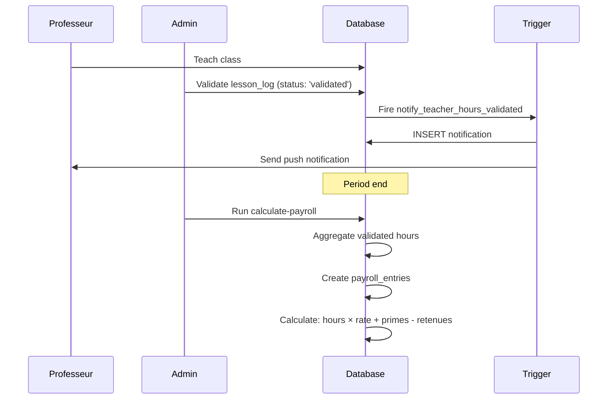
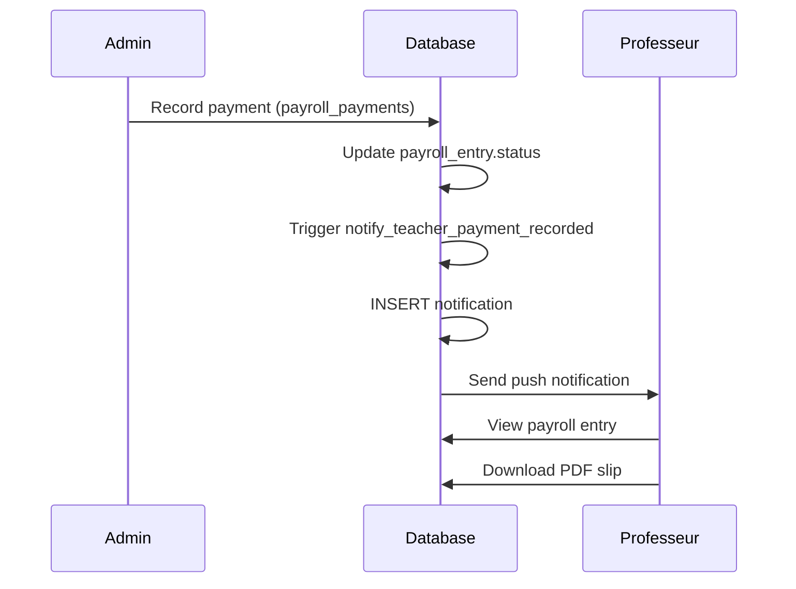

# Teacher Payroll System - Technical Documentation

## Overview

The Teacher Payroll System provides comprehensive payroll management for teachers, including automated calculations, detailed hour breakdowns, mobile and web interfaces, notification system, and PDF slip generation.

## Architecture

### Database Layer

#### Core Tables

**payroll_periods**
- Stores payroll period definitions (monthly, bi-weekly, etc.)
- Linked to academic years and schools
- Status workflow: draft → pending_payment → paid/cancelled

**payroll_entries**
- Main payroll records per teacher per period
- Stores: validated hours, hourly rate, amounts (base, gross, net)
- Links to salary components and payments

**salary_components**
- Flexible adjustment system (primes, retenues, avances, bonus, deductions)
- Can be positive or negative amounts
- Automatically updates payroll entry totals

**payroll_payments**
- Records actual payments made to teachers
- Supports multiple payment methods: cash, bank transfer, check, mobile money
- Partial payments allowed, automatically updates status

**payroll_slips**
- Stores generated PDF slip metadata
- Signed URLs for secure access

**lesson_logs**
- Source data for hour calculations
- Status must be 'validated' to be included in payroll
- Joined with classes and subjects for breakdown

#### Relationships

```
payroll_periods (1) ──< (N) payroll_entries (N) ──< (1) users (teachers)
                             │
                             ├── (N) salary_components
                             ├── (N) payroll_payments
                             └── (1) payroll_slips

lesson_logs (validated) ──> aggregated by ──> payroll_entries
```

### Application Layer

#### Backend (packages/data)

**Queries** (`packages/data/src/queries/payroll.ts`)

- `payrollPeriodQueries`: CRUD operations for periods
- `payrollEntryQueries`: CRUD operations for entries, with relations
- `salaryComponentQueries`: Add/remove adjustments
- `payrollPaymentQueries`: Record payments, auto-update status
- `payrollStatsQueries`:
  - `getTeacherStats`: Global statistics
  - `getTeacherHoursBreakdown`: Detailed breakdown by class/subject
  - `getTeacherCurrentMonthHours`: Current month estimate

**Hooks** (`packages/data/src/hooks/usePayroll.ts`)

- `usePayrollPeriods`: List all periods for a school
- `usePayrollEntriesByTeacher`: List entries with filters
- `useTeacherHoursBreakdown`: Get detailed breakdown
- `useTeacherCurrentMonthEstimate`: Get current month estimate
- Mutations: create/update/delete operations

#### Web Interface (apps/web)

**Teacher Payroll Page** (`apps/web/src/app/(dashboard)/teacher/payroll/page.tsx`)

Features:
- Current month estimate card (blue highlight)
- Stats overview (hours, gross, paid, pending)
- Filter buttons (All, Paid, Pending)
- Payroll entry cards with:
  - Period name and status badge
  - Date range
  - Hours, rate, amounts
  - Salary components breakdown
  - "Voir détail" button → opens HoursBreakdownDialog
  - "Télécharger" button → downloads PDF

**HoursBreakdownDialog** (`apps/web/src/app/(dashboard)/teacher/payroll/components/HoursBreakdownDialog.tsx`)

- Table view with: Class, Subject, Period, Hours, Sessions, Rate, Amount
- Export to CSV functionality
- Total row

#### Mobile Interface (apps/mobile)

**Role-Based Navigation** (`apps/mobile/app/(tabs)/layout.tsx`)

- Uses `useRole()` hook
- Teacher tabs: Home, Schedule, Attendance, **Payroll**, Notifications, Profile
- Student/Parent tabs: Home, Schedule, Grades, Notifications, Profile

**Payroll Main Page** (`apps/mobile/app/(tabs)/payroll.tsx`)

Features:
- Pull-to-refresh
- Current month estimate card
- Stats grid (4 cards)
- Filter buttons
- FlatList with `PayrollEntryCard` components

**PayrollEntryCard** (`apps/mobile/components/payroll/PayrollEntryCard.tsx`)

- Displays: period, status badge, dates, hours, amount
- Navigates to detail page on press
- Styled card with shadow

**Payroll Detail Page** (`apps/mobile/app/payroll/[id].tsx`)

Features:
- Header with period name and status badge
- Main info card (hours, rate, gross, net)
- Adjustments card (if any components)
- **HoursBreakdownTable** component
- Payment history (if any payments)
- "Télécharger la fiche PDF" button

**HoursBreakdownTable** (`apps/mobile/components/payroll/HoursBreakdownTable.tsx`)

- Horizontal scrollable table
- Monospace font for numbers
- Total row highlighted

### Edge Functions

**generate-payroll-slip** (`supabase/functions/generate-payroll-slip/`)

- Generates PDF using Puppeteer
- Stores in `payroll_slips` table
- Returns signed URL for download

**send-payroll-notification** (`supabase/functions/send-payroll-notification/`)

- Called by database triggers
- Sends push notifications via Expo
- Handles invalid tokens gracefully

### Database Triggers

**notify_teacher_hours_validated**

- Trigger: `lesson_logs` INSERT/UPDATE
- Fires when status → 'validated'
- Creates notification in database
- Calls push notification Edge Function
- Metadata: lessonLogId, duration, className, subjectName

**notify_teacher_payment_recorded**

- Trigger: `payroll_payments` INSERT
- Fires on payment recording
- Creates notification in database
- Calls push notification Edge Function
- Metadata: paymentId, amount, paymentMethod, periodName

## Flow Diagrams

### Hour Calculation Flow



### Payment Flow



## API Reference

### Queries

#### getTeacherHoursBreakdown

```typescript
async getTeacherHoursBreakdown(
  teacherId: string,
  periodId?: string
): Promise<TeacherHoursBreakdown[]>
```

Returns detailed breakdown of validated hours grouped by class, subject, and period.

**Returns:**
```typescript
{
  className: string;
  subjectName: string;
  periodName: string;
  totalHours: number;
  sessionsCount: number;
  hourlyRate: number;
  amount: number;
}[]
```

#### getTeacherCurrentMonthHours

```typescript
async getTeacherCurrentMonthHours(
  teacherId: string
): Promise<TeacherCurrentMonthEstimate>
```

Calculates estimate for current month's pending payroll.

**Returns:**
```typescript
{
  currentMonthHours: number;
  estimatedAmount: number;
  lastHourlyRate: number;
  validatedSessionsCount: number;
  periodStart: string | null;
  periodEnd: string | null;
}
```

### Hooks

#### useTeacherHoursBreakdown

```typescript
const { data: breakdown, isLoading } = useTeacherHoursBreakdown(
  teacherId: string,
  periodId?: string
);
```

#### useTeacherCurrentMonthEstimate

```typescript
const { data: estimate } = useTeacherCurrentMonthEstimate(
  teacherId: string
);
```

## Notification System

### Types

- `hours_validated`: Sent when lesson hours are validated
- `payroll_payment`: Sent when a payment is recorded

### Notification Payload

```typescript
{
  recipient_id: string;  // Teacher's user ID
  type: 'hours_validated' | 'payroll_payment';
  title: string;
  message: string;
  metadata: {
    // hours_validated
    lessonLogId: string;
    duration: number;
    className: string;
    subjectName: string;
    date: string;

    // payroll_payment
    paymentId: string;
    amount: number;
    paymentMethod: string;
    periodName: string;
    paymentDate: string;
  };
  read: boolean;
  created_at: string;
}
```

## Security Considerations

### RLS Policies

- `payroll_entries`: Teachers can only see their own entries
- `payroll_periods`: School context filtering
- `salary_components`: Linked to entries, inherits RLS
- `payroll_payments`: Readable by entry owner, writable by admins

### Service Role

- Edge Functions use service role key
- Database triggers run with elevated privileges
- All user queries use user context

## Performance Optimization

### Database Indexes

- `payroll_entries(teacher_id, payroll_period_id)`
- `lesson_logs(teacher_id, status, date)`
- `payroll_payments(payroll_entry_id)`

### Query Optimization

- Breakdown query groups by class/subject in memory
- Current month estimate uses date range filtering
- Hooks use React Query caching with 5-minute stale time

## Error Handling

### Common Errors

1. **No validated hours**: Payroll entry shows 0 hours
2. **Missing hourly rate**: Uses 0, displays warning
3. **Invalid push token**: Automatically removed from user metadata
4. **PDF generation timeout**: Retry with exponential backoff

## Future Enhancements

1. **Evolution Charts**: Historical data visualization (recharts)
2. **Advanced Filters**: Academic year, date range, search, sorting
3. **Multi-currency Support**: Currently FCFA only
4. **Bulk Payments**: Process multiple teachers at once
5. **Export Formats**: Excel, CSV in addition to PDF

## Troubleshooting

### Notifications Not Sending

1. Check `user_devices` table for push tokens
2. Verify pg_net extension is enabled
3. Check Edge Function logs
4. Test push notification manually via Expo API

### Breakdown Shows No Data

1. Verify lesson_logs have status = 'validated'
2. Check class_id and subject_id are not null
3. Ensure date falls within payroll period

### PDF Download Fails

1. Check storage bucket permissions
2. Verify Puppeteer is available in Edge Function
3. Check signed URL expiration (default 1 hour)

## Related Documentation

- [Database Schema](../supabase/migrations/20250115000001_create_core_tables.sql)
- [RLS Policies](../supabase/migrations/20250115000002_enable_rls_policies.sql)
- [Mobile User Guide](./teacher-mobile-payroll-guide.md)
